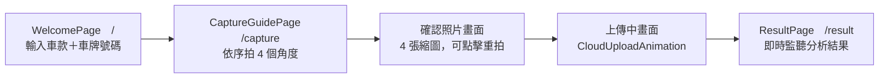
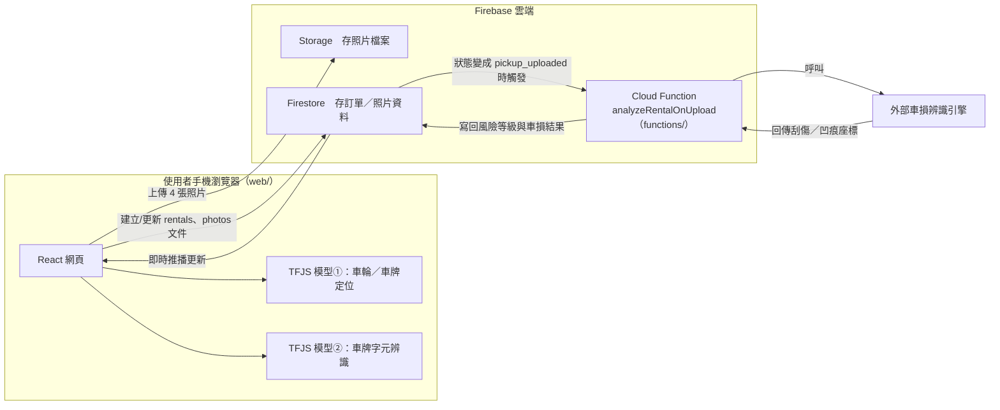
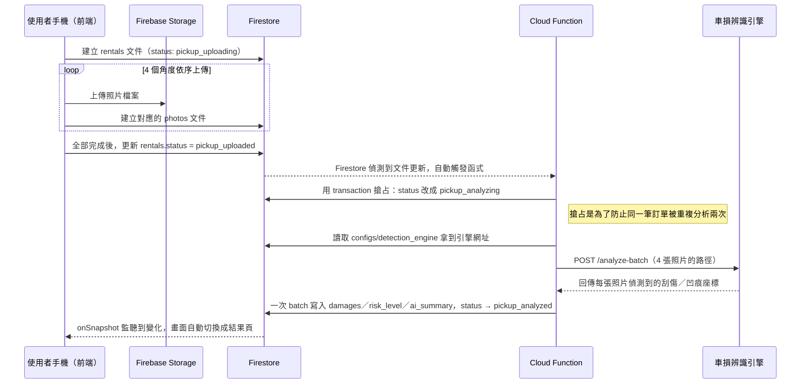
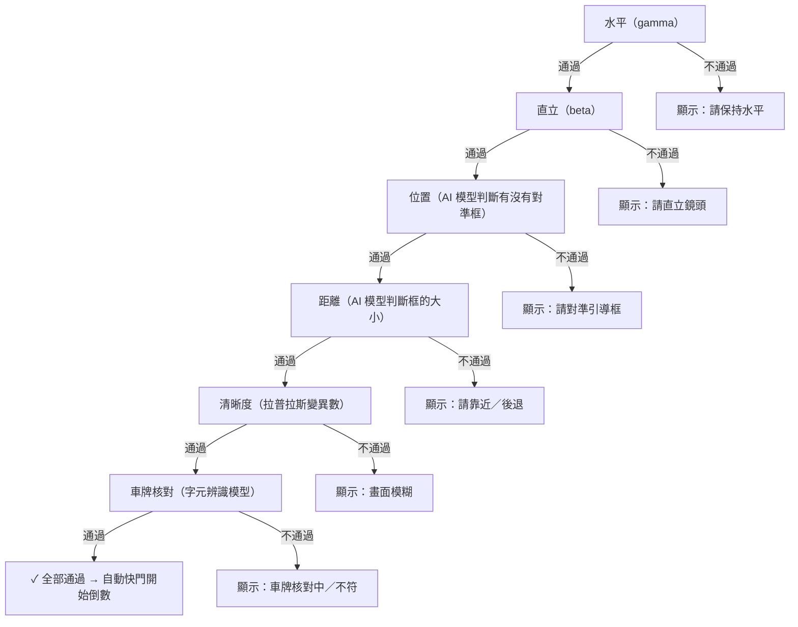
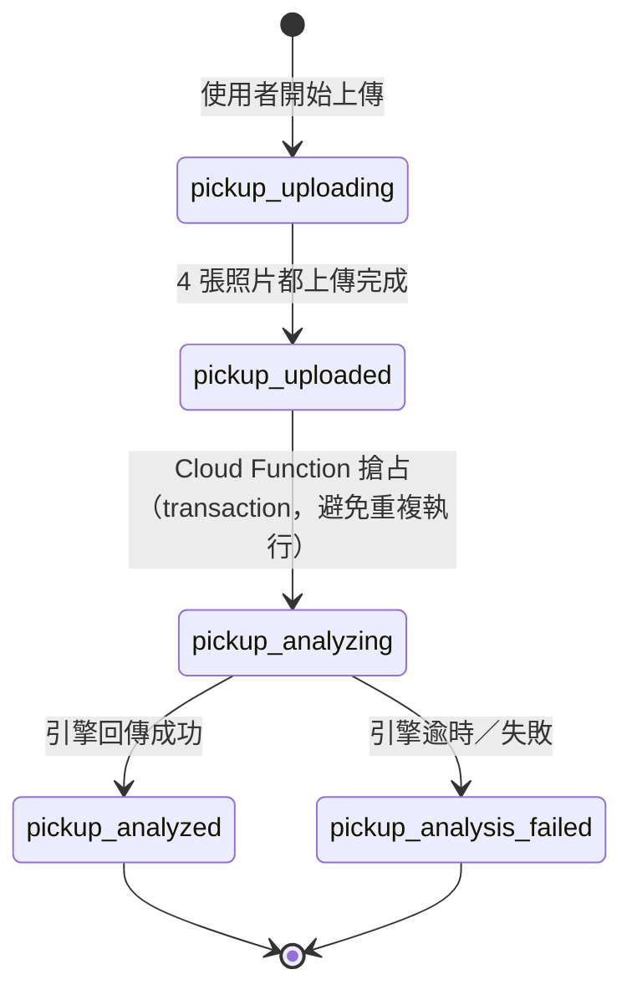

# 智能檢車｜開發歷程回顧：從規劃到現況

給用途：這是給自己看的技術筆記，記錄「原本照任務清單規劃的架構」跟「實際做出來的東西」之間差在哪裡、為什麼會差、怎麼調整的。跟 `PROGRESS_SUMMARY.md`（只記錄現況）不一樣，這份是有前因後果的敘事，方便之後回顧「當初為什麼這樣做」，或跟別人口頭說明時有東西可以照著講。

因為我還在熟悉這些技術，內文會盡量把專有名詞解釋清楚一點，不會預設你已經知道那些名詞在幹嘛。

對照的規劃文件是 `智能檢車_開發任務清單與Prompt範本_審閱修正版.md`（以下簡稱「任務清單」），裡面把整個開發拆成任務 0~13。這份筆記就照這個任務編號一路走下來，每個段落會分成三塊：**原規劃**（任務清單怎麼寫的）、**實際遇到的問題**、**現在怎麼做**。

---

## 整體架構是什麼

先講結論：這是一個「引導使用者用手機拍 4 張車輛照片、AI 自動判斷有沒有拍好、傳到雲端做車損辨識」的網頁 App（PWA，可以加到手機主畫面、像 App 一樣用，但本質是一個網站）。

技術棧分兩塊：

- **前端**（`web/` 資料夾）：React + Vite 寫的網頁，會用到手機的相機、陀螺儀（判斷手機有沒有拿正/拿平）、還有兩個跑在瀏覽器裡的小型 AI 模型（一個負責「畫面裡車輪/車牌在哪」、一個負責「車牌上寫的是什麼字」）。這些模型不是打電話問伺服器，是直接下載到手機瀏覽器裡跑，好處是不用等網路來回、拍照當下就能給提示，壞處是模型不能做得太大（太大手機跑不動、也下載太久）。
- **後端**（`functions/` 資料夾）：Firebase 的「雲端函式」（Cloud Function，可以想成「不用自己顧一台伺服器、事件發生時雲端自動幫你跑一段程式」的服務），負責真正判斷「車子有沒有刮傷/凹痕」——這個判斷比較吃運算資源，模型也比較大，所以放在雲端做，不是塞進手機瀏覽器。

流程大致是：使用者打開網頁 → 輸入車牌號碼 → 手機相機依序拍 4 個角度（左前/右前/左後/右後）→ 拍照過程中前端的兩個小模型會即時提示「拍歪了」「太模糊」「車牌對不上」之類的訊息，全部通過才會自動拍下去 → 4 張都拍完後上傳 → 雲端的車損辨識模型分析 → 結果畫面顯示哪裡有刮傷/凹痕。

畫面層面的流程圖：

前端跟雲端之間怎麼串起來的架構圖：

看這張圖時要注意：**兩個 TFJS 模型是在使用者手機瀏覽器裡跑的，不是打電話問伺服器**；真正比較重的「判斷有沒有車損」這個運算，才是在 Firebase 那一側（雲端）做。這個分工就是前面提到「模型不能做太大」的原因——手機端這兩個模型要夠小、夠快，才能即時給拍照提示。

---

## 前後端怎麼串接：一次完整的上傳到分析

上面的架構圖只畫了「誰跟誰有連線」，這裡把時間軸攤開，照實際發生的先後順序，把「按下確認上傳」到「畫面顯示結果」之間到底發生了什麼事講一遍。

逐段拆解：

1. **建立訂單、上傳照片（前端主導）**：使用者按下「確認上傳」的那一刻，前端先在 Firestore（一種雲端資料庫，資料長得像一份份的 JSON 文件，不是傳統表格）建立一筆 `rentals` 文件，狀態標成 `pickup_uploading`。接著依序把 4 張照片傳去 Firebase Storage（純粹放檔案的地方），每上傳完一張，就在 `photos` collection 底下多建一筆對應紀錄。每個角度都有自己的完成旗標，重試時只補還沒成功的角度，不會建出重複資料。
2. **狀態一改，雲端自動醒來**：4 張都傳完後，前端把 `rentals.status` 改成 `pickup_uploaded`。這是整條後端流程唯一的觸發點——`functions/` 裡用 `onDocumentUpdated` 註冊了一個 Cloud Function，專門盯著 `rentals` collection 的更新。這是「事件觸發（trigger）」的串接方式，跟一般「前端主動打 API、等後端回應」不一樣——前端寫完資料庫就沒事了，後端自己聽到動靜才醒過來處理。
3. **搶占，避免分析兩次**：雲端函式的觸發機制官方保證「至少送達一次」，同一個事件有小機率會被觸發兩次。函式一開始先用 transaction（一段操作要嘛全部成功要嘛全部失敗，不會被插隊看到做到一半的狀態）把狀態從 `pickup_uploaded` 搶著改成 `pickup_analyzing`，第二次觸發時發現狀態已經不對就直接放棄。
4. **呼叫真正做辨識的引擎**：搶到執行權後，函式讀一份存在 Firestore 裡的 `configs/detection_engine` 設定文件拿到引擎網址（存資料庫不寫死在程式碼裡，換網址只要改一筆資料），把 4 張照片路徑 POST 給引擎的 `/analyze-batch`，引擎回傳每張照片偵測到的車損座標。
5. **寫回結果，畫面自動更新**：函式算出風險等級、組出摘要文字，跟車損結果一次用 batch 寫回 Firestore，狀態改成 `pickup_analyzed`。前端 `ResultPage.tsx` 從進頁面就用 `onSnapshot`「訂閱」這筆訂單資料——Firestore 的即時監聽功能，資料一變所有訂閱的畫面立刻收到最新版本，不用使用者按重新整理，前端也不用寫「每隔幾秒問一次好了沒」的輪詢邏輯。

**如果引擎掛掉或逾時**：任務清單原本沒規劃這個情境。實際做法是只要上面任何一步拋錯，函式會把照片標成分析失敗、訂單狀態改成 `pickup_analysis_failed`，前端看到會顯示「分析失敗，請稍後再試或聯繫客服」，不會讓使用者卡在「AI 分析中」畫面前面等到天荒地老。這個失敗狀態是規劃文件裡沒有的，是實作時另外加上去的。

---

## 任務 0～2：專案骨架、模型驗證、模型訓練

**原規劃**：Vite + React 骨架，裝 TensorFlow.js（跑 AI 模型用）、OpenCV.js（影像處理，例如判斷畫面清不清晰）、Tesseract.js（車牌文字辨識）三個套件；用 Roboflow 標註「車輪」「車牌」兩類物件、Google Colab 訓練 YOLOv8 Nano（一個很輕量的物件偵測模型架構），轉成瀏覽器看得懂的 TensorFlow.js 格式。

**現況**：這幾個任務基本照規劃走，模型訓練/格式轉換也都驗證通過了。**但長期來看，最後兩個套件（OpenCV.js、Tesseract.js）其實都被拿掉了**——這是後面任務 7 那個大調整的源頭，詳見下面任務 7 的段落。這裡先只記結論：目前 `opencv.js` 雖然還裝著，但只有一個內部診斷頁面在用它做套件載入測試，正式功能已經不靠它了；Tesseract.js 則是完全被換掉，程式碼裡已經找不到了。

`src/platform/` 這個資料夾（任務清單裡標🅰️的部分，用意是把「呼叫手機相機/感測器」這類瀏覽器專屬功能都集中包成獨立的 hook，之後如果要把這個網頁封裝成手機 App，只要改這幾個檔案內部、不用動到其他畫面）**確實照規劃做了**，目前有 `useCameraCapture.ts`、`useSensorPermission.ts`、`useHapticFeedback.ts` 三個檔案在裡面，跟任務清單要求的一致。

---

## 任務 3、3.5：相機權限與 iOS 感測器權限

**原規劃**：按鈕點下去才跳出相機權限請求（不能一進畫面就跳，會嚇到使用者也容易被拒絕）；相機比例用 `aspectRatio: { ideal: 16:9 }` 這種「建議值」而非「強制值」跟手機要，並且用 `track.getSettings()` 讀出手機實際給的比例，不要自己假設。另外因為 iOS 13 之後，Safari 瀏覽器要求「要讀陀螺儀資料前，必須先跳出一個權限請求對話框，而且這個請求一定要跟使用者的點擊動作綁在同一個時間點觸發」，所以任務 3.5 特別把這個 iOS 專屬的權限請求，塞進跟相機權限請求「同一次點擊」裡一起處理。

**實際遇到的問題**：相機的**畫面比例**這件事，實測後發現如果照規劃硬性指定 16:9 或後來考慮過的 9:16，部分手機會直接把鏡頭原本看得到的範圍「裁掉一部分」去湊這個比例（因為手機鏡頭原生的感光元件比例不一定是 16:9），畫面看起來像是被放大了，使用者實際能拍到的範圍反而變小，跟直覺不符。

**現況**：相機比例**目前沒有指定任何 `aspectRatio` 約束**，直接用手機鏡頭原生預設的取景範圍（等於是規劃裡「用 `ideal` 而非 `exact`」這個保守做法又更進一步——連 `ideal` 都不強制指定了）。這個決定是實測過後刻意維持的，不是還沒做完。

iOS 感測器權限這塊倒是完全照規劃做了，跟相機權限包在同一個按鈕點擊事件裡處理，這個部分沒有繞路。

---

## 任務 4、5：提示優先權狀態機、陀螺儀防呆

**原規劃**：畫面同時只顯示「當下最需要處理」的一則提示，優先順序是「水平 > 直立 > 位置 > 距離 > 清晰度 > 車牌」——例如手機沒拿平的話，就只顯示「請保持水平」，不會同時跳出五六則提示轟炸使用者。陀螺儀部分：左右傾斜（gamma）超過 ±5 度就算沒拿平，前後傾斜（beta）沒有落在 70°~90° 之間就算沒拿直。

**實際遇到的問題**：
1. **±5 度太嚴格了**。手機拿在手上本來就會有生理性的手抖，±5 度這個容錯範圍在真實情況下幾乎不可能穩定維持住，會讓使用者覺得「怎麼一直沒過」。
2. 陀螺儀在 beta 角度接近 90 度（也就是手機幾乎垂直立起來對著車子）的時候，遇到一個叫**「萬向鎖」（gimbal lock）** 的經典問題——這是描述 3D 旋轉角度的數學方式本身的限制：當其中一軸轉到接近 90 度時，另外兩軸的角度會變得很不穩定、甚至互相干擾，讀出來的數字會跳來跳去，不是手機真的在晃，是角度計算方式本身在那個角度附近會失真。

**現況**：容錯範圍大幅放寬——gamma 從 ±5° 放寬到 **±25°**，beta 的可接受範圍從 70°~90° 放寬到 **60°~95°**。萬向鎖問題也已經修正（讓判斷邏輯在角度接近臨界值時不會因為數學上的不穩定而誤判）。優先權順序、單一提示顯示這些邏輯設計本身跟規劃一致，沒有變。

六層優先權判斷鏈，同一時間只顯示「第一個沒通過」的那一則提示，後面幾層完全不會被檢查：

---

## 任務 6：AI 視覺定位（車輪/車牌位置與距離判斷）

**原規劃**：模型跑出車輪/車牌的框之後，換算成「相對畫面的百分比座標」（不是死板的像素數字，這樣不同螢幕大小的手機都適用）。位置判斷：偵測到的框中心點座標，跟預先設定好的「目標位置」座標比對，差距太大就提示「請上移/下移」；距離判斷：偵測框佔畫面的面積比例，跟目標面積比，差距超過 10% 就提示「請靠近/後退」。

**實際遇到的問題**：跟任務 5 類似的狀況——**距離的 10% 容錯範圍太嚴格**，真人手持拍攝很難剛好落在窄窄的 10% 區間內。另外位置判斷原本用「中心點座標差距是否小於一個固定的容錯值（8%）」，這個做法有個問題：不管畫面上引導框畫得多大多小，容錯範圍永遠是同一個固定數字，跟使用者實際「看起來對準了沒」的直覺感受對不太起來（框畫得大，使用者會覺得「這樣應該算對準了吧」，但固定 8% 的容錯可能還是判定沒過）。

**現況**：
- 距離容錯從 10%（規劃值，中途曾經先放寬到 40%）再進一步放寬到 **60%**。
- 位置判斷邏輯整個換掉，改成「偵測框的中心點，是不是真的落在畫面上那個虛線引導框的範圍裡面」——這樣跟畫面上「引導框變綠燈、代表已經對準」這個視覺回饋用的是同一套判斷依據，使用者用眼睛看畫面就能預期會不會通過，不會有「畫面上看起來明明對準了、但系統說沒過」的落差感。
- 引導框的座標系統本身有一個額外的省工技巧：因為車子左右兩側基本上是鏡像對稱的，右前/右後的引導框座標直接用左前/左後的座標鏡像算出來，不用四個角度各自重新校正一次。

---

## 任務 7：畫質檢驗與車牌辨識——這是整個專案架構偏離規劃最多的地方

這個任務原本規劃的做法幾乎整套被換掉了，值得detail地記一下前因後果。

### 畫質（模糊）偵測

**原規劃**：用 OpenCV.js（一個很成熟、功能很齊全的電腦視覺函式庫）內建的「拉普拉斯變異數」演算法算清晰度——白話講，這個演算法會去看畫面裡「邊緣的銳利程度」，銳利的邊緣多，變異數就高，代表對焦準、畫面清楚；如果整張都糊糊的，邊緣不明顯，變異數就低。

**實際遇到的問題**：OpenCV.js 這個套件雖然功能強，但它是用 C++ 寫的函式庫、透過 WASM（一種讓瀏覽器可以跑非 JavaScript 語言編譯出來的程式碼的技術）包成網頁能用的版本，整包檔案體積高達 **15MB 以上**。而這裡實際只需要用到它裡面「拉普拉斯變異數」這一個很單純的運算，為了這一個小功能背 15MB 的下載量，比例上很不划算，尤其考慮到使用者是在手機、可能還是行動網路的情況下使用。

**現況**：拉普拉斯變異數這個演算法本身的數學邏輯不難（就是拿一張圖，跟一個固定的 3x3 小矩陣做卷積運算，算出結果的變異數），改成**自己用純 JavaScript + Canvas 重寫一遍**，不透過 OpenCV.js。功能一樣、判斷邏輯一樣，只是不用背那 15MB 的套件下載了。另外還發現一個實務上的細節問題：使用者放開手、手機剛停下來的那個瞬間，鏡頭可能還在自動對焦、還沒真的清晰，如果只靠背景每 200ms 量一次的舊數值來決定要不要拍，會抓到「剛好上一次量測時還算清晰，但真正按下快門那一刻其實還沒對好焦」的空窗期——所以現在快門真正觸發前，還會**額外對當下那一影格重新測一次清晰度**，沒過的話取消這次拍攝，不是只信任舊數據。

### 車牌辨識（這是最大的架構改動）

**原規劃**：用 Tesseract.js（一個通用的網頁端文字辨識套件，只載入英文語言包，因為台灣車牌沒有中文字）去讀車牌上的文字，跟一個「預期車牌號碼」比對是否相符。而且規劃文件裡明確把「這個預期車牌號碼到底從哪裡來」列為一個**還沒解決、會卡住任務 7 元件設計的阻塞性問題**（規劃文件「待確認事項」第 2 點）。

**實際遇到的問題**：Tesseract.js 是設計來讀「一般印刷文字」的通用型 OCR，車牌是一種特殊字體、拍攝角度歪斜、光線反光都很常見的場景，通用型 OCR 在這種條件下準確率不夠穩定——這也正是規劃文件自己在「待確認事項」裡就已經預先提醒過的疑慮（"OCR 辨識準確率在瀏覽器端通常不如預期"）。

**現況**：整個換成**自己額外訓練一個專門辨識車牌字元的物件偵測模型**（YOLO11n 架構，33 個類別，對應 0-9 扣掉容易跟英文字母搞混的「4」、A-Z 扣掉容易跟數字搞混的「O」「I」，也不含車牌上的「-」分隔符號——這幾個字元刻意不訓練，是為了減少模型混淆同時降低訓練標註的工作量）。運作方式不是「讀一整排文字」，而是「把車牌裁下來的小圖丟進去，模型把每一個字元各自框出來、各自判斷是哪個字，再依照框的左右位置排序組成完整車牌號碼」——概念上比較接近任務 6 拿來抓車輪/車牌位置的模型，而不是像 Tesseract.js 那種讀整段文字的傳統 OCR。

比對邏輯也跟著調整：原本設想比較接近「整串字完全比對」，現在改成**模糊比對**——只要辨識出來的字元裡，有**至少 5 個字元**（滿分 7 碼）跟預期車牌號碼對得起來（不要求順序、不要求長度完全一樣），就算通過。這樣可以容忍模型偶爾認錯一兩個字元、或多認/漏認一兩個字元的情況，不會因為單一個字認錯就整個判定失敗。

規劃文件裡提到的那個「阻塞性問題」——`expectedPlateNumber`（預期車牌號碼）到底從哪裡來——**已經解決**：現在是使用者在拍照前的首頁畫面上，自己手動輸入車牌號碼（目前是測試性質的輸入框，還不是接真正的車輛查詢系統，這部分列在後面的待辦裡）。

另外規劃文件也提過「車牌透視校正」（因為拍攝角度歪，車牌看起來會變成梯形而不是長方形，理論上先把它「拉正」再辨識，準確率應該會更好）——這個做法**實際試過但後來放棄了**，確認新版的字元偵測模型準確率已經夠高，不需要多這一道校正手續（多一道處理，理論上會增加辨識前的等待時間跟出錯機會）。

兩條路徑對照：

| | 原規劃 | 現況 |
|---|---|---|
| 1 | 裁切車牌區域 | 裁切車牌區域（留 12% 邊界）|
| 2 | 丟進 Tesseract.js（通用文字 OCR） | letterbox 成 640x640 |
| 3 | 讀出一整排文字 | 丟進自訓練 YOLO11n 字元偵測模型 |
| 4 | 跟預期車牌完全比對 | 逐一框出每個字元＋各自分類 |
| 5 | — | 依 x 座標排序組成字串 |
| 6 | — | 跟預期車牌模糊比對（≥5/7 字元相符） |

### 為什麼任務 11（資源預載）也跟著變了

因為任務 7 把 OpenCV.js（拿掉）跟 Tesseract.js（換掉）都動了，任務 11 規劃要「預先在背景載入 OpenCV.js 跟 Tesseract.js」這件事，目標自然也就跟著換成「預先載入任務 6 跟任務 7 現在實際在用的兩個 TensorFlow.js 模型」（車輪/車牌定位模型＋車牌字元辨識模型）。背景預載、進度顯示這些原本的設計精神有保留，只是預載的「東西」換了。

---

## 任務 8：自動快門

**原規劃**：手機靜止判定（陀螺儀角速度低於 3°/秒，持續 1 秒）通過、且前面所有條件都過關後，用一個圓形進度圈動畫填滿代表倒數，填滿就自動拍照＋震動＋音效。如果使用者手一直抖、15~20 秒都沒辦法觸發，要提供手動快門逃生。

**現況**：這部分基本照規劃走，靜止判定、1 秒進度圈、18 秒逾時（落在規劃建議的 15~20 秒區間內）都有做。有一個比規劃更貼心的地方：規劃是「等到使用者卡住 15~20 秒才跳出手動快門選項」，實際做法是**手動快門鍵一開始就顯示在畫面上**（不用等卡住才出現），只是在條件還沒全部通過之前，按鈕是半透明、按不下去的，全部通過才會變亮可以按——這樣使用者從頭到尾都知道「手動拍照這個選項存在」，不會有一種「卡住好久突然冒出一個按鈕」的困惑感，同時還是保留了「條件沒過不能亂拍」的把關。

---

## 任務 9：結果渲染——規劃裡的「使用者補拍回報」這塊沒有做

**原規劃**：後端分析完，前端把結果疊在照片上——**綠色框**代表「已知舊傷」（車子本來就有、之前記錄過的傷）、**紅色框**代表「這次疑似新增的車損」。使用者還可以**點擊照片上沒被框到的地方**，系統會另外開一個「不套引導框、單純取景」的相機，讓使用者對著那個位置拍一張特寫，標記成「使用者回報」上傳，做為模型之後訓練的額外資料來源。

**實際遇到的問題（比較像是規劃範圍的自然收斂，不是踩到技術地雷）**：真正動工做「結果渲染跟補拍」這塊時，後端的車損辨識 API 規格才真正定案（規劃文件當時就有寫「等後端 API 規格確定後再做」），定案後端只回傳「這次偵測到的車損」，並沒有「已知舊傷」這個資料維度——也就是說，車輛過去的傷況紀錄這件事，目前系統架構裡根本沒有存在，自然也就沒有「舊傷用綠框、新傷用紅框」這種區分的資料基礎。

**現況**：目前做出來的是規劃裡「結果渲染」的那一半——照片疊車損框（凹痕用紅色系、刮傷用黃色系，只畫外框不填色）、風險等級徽章（低/中/高風險）、點縮圖可以放大看細節（燈箱功能）。**「點擊沒框到的地方去補拍特寫回報」這個功能沒有做**，`consentTimestamp`（同意時間戳記）、`retentionPolicy`（資料保存政策）這兩個規劃文件裡特別提醒要預留的隱私相關欄位，目前也還沒加進資料結構裡。這兩塊都还是待辦，不是忘記了，是還沒排進來做。

值得一提的是後端這塊的實際架構，規劃文件裡沒有具體指定要怎麼做（只寫「後端分析」），實際採用的是 **Firebase 全家桶**（Firestore＋Storage＋Cloud Function），完整運作細節見前面「前後端怎麼串接」那一章，這裡不重複。

`rentals` 文件在 Firestore 裡的狀態生命週期（這是規劃文件裡沒有的、實作時另外設計出來的狀態機）：

風險等級的判斷規則很單純：只要偵測到任何一處凹痕，就算「高風險」；沒有凹痕但有刮傷，算「中風險」；都沒有，算「低風險」——凹痕的嚴重程度優先權高於刮傷，不管刮傷有幾處都一樣。這個規則、以及給使用者看的摘要文字，目前分別在前端跟後端各自寫了一份（原因是前端每次改動都會自動部署上線，但後端要改文案得額外走一次部署流程，乾脆讓前端自己組一份摘要文字，不用每次調整文案的說法都要麻煩到後端重新部署）——這代表現在後端資料庫裡存的那句摘要，跟畫面上使用者實際看到的那句摘要，**文字內容已經不完全一樣了**，是刻意的取捨，不是 bug，但要記得這件事，以免以後改文案只改了一邊。

---

## 任務 10：權限被拒絕的處理——沒有做成規劃裡指定的獨立元件

**原規劃**：做一個專門的 `PermissionErrorBoundary` 元件跟 `usePermissionGuard` 這個 hook，統一處理「相機權限被拒絕」（這種要整個擋住、不能繼續）跟「感測器權限被拒絕」（這種不擋，只是降級成手動拍照模式）兩種情境，各自用不同的錯誤畫面文案。

**現況**：目前程式碼裡**沒有**這兩個規劃指定名稱的檔案。實際做法是把權限處理**拆開分散在各自相關的地方**——例如任務 3.5 的 `useSensorPermission.ts` 本身就會回傳授權狀態，讓呼叫它的畫面自己決定要不要降級；相機開啟前現在還多了一個規劃裡沒提到的**定位權限（GPS）檢查**，拿不到定位就直接擋住、不讓相機開啟。功能面上「相機被拒會擋流程」「感測器被拒不會擋流程、改手動模式」這兩件事其實都有做到，只是沒有集中包成規劃設想的那一個獨立元件/hook，而是分散寫在各個用得到的地方。這算是架構上跟規劃文件不完全一致的地方，值得之後如果要重構錯誤處理邏輯時，考慮要不要真的抽出一個統一的元件。

---

## 任務 11、12：資源預載、跨裝置測試

**任務 11（資源預載）**：內容前面任務 7 段落已經解釋過（預載的東西從 OpenCV.js/Tesseract.js 換成兩個 TensorFlow.js 模型），機制本身（背景載入、不擋住畫面、進度提示）照規劃做了。

**任務 12（跨裝置測試矩陣）**：**原規劃**是找好幾款不同的真實 iOS/Android 手機（含中低階機型）、實機測試，並且做一個簡易的效能監控面板記錄各模組運算耗時。**現況**：目前沒有做規劃裡設想的那種正式測試矩陣文件跟效能監控面板。實際採用的替代做法是**開發過程中大量用本機端的 headless（不開實際視窗）瀏覽器截圖**（工具是 Edge 瀏覽器的 headless 模式，或臨時裝一下 `playwright` 用完就移除）自己檢查排版跟動畫有沒有跑版——這個做法意外地抓到了好幾個純粹看程式碼看不出來的 bug，例如標題文字兩行疊在一起、相機滿版顯示其實被放大裁切了、左右兩個角度的引導框方向擺反了這類「要親眼看畫面才會發現」的問題。`playwright` 還有一個参數可以在沒有接實體鏡頭的電腦上模擬相機畫面，方便測試拍照流程。這個做法補足了「沒有多台真實手機可以測」的限制，但終究不是規劃裡要求的「真機測試矩陣」，裝置間的實際差異（尤其陀螺儀/OCR 在不同手機上的表現）目前還是沒有系統化驗證過。

---

## 任務 13：App 封裝——仍照規劃暫緩

規劃文件本來就把這個任務標成「Phase 2，暫緩實作」，要等 Phase 1（任務 1~12）全部穩定驗收過才啟動。目前確實還沒開始，這點沒有偏離規劃。前面任務 0 提到的 `src/platform/` 抽象層有先照規劃做好，代表之後真的要做這個任務時，理論上換掉這三個 hook 內部實作就好，不用整個重寫呼叫這些功能的畫面元件——這算是規劃階段就先做了準備工作，還沒驗證過實際換裝時到底有多順利就是了。

---

## 規劃之外、額外做的事：視覺設計

任務清單整份文件是純功能/技術規格，完全沒有規範畫面長怎樣。實際開發時額外做了一輪完整的視覺設計調整，方向是仿 Apple 官方設計語言（系統字體、藍灰色系、大圓角卡片、柔和陰影），中途也試過另一種「檢驗證書」風格（比較正式、帶點公文/證書的視覺語言，例如金色系、襯線字體），後來確認方向改成現在這套 Apple 風格，捨棄了證書風格的做法。這整塊算是規劃文件範圍之外、單純是產品體驗上的追加投入。

---

## 待確認事項清單——現在回頭看，哪些解決了

規劃文件最後列了 9 點「待確認事項」，回頭盤點一下現況：

1. **各方位黃金標準照座標**：已經用相對百分比座標系統解決，四個角度各自校正過，左右對稱的角度還用鏡像節省一半工作量。
2. 🔴 **`expectedPlateNumber` 從哪來（原本標記為阻塞性問題）**：已解決，來源是使用者拍照前自己在首頁手動輸入。
3. **OCR 手動確認的資安疑慮**：目前 `ENABLE_MANUAL_CONFIRMATION_LOCK` 這個逃生選項的開關還設成關閉（測試方便用），代表這個潛在疑慮實務上還沒真的被使用者路徑觸發過，正式上線前要記得把這個開關打開之前，這個問題應該要重新拿出來討論一次。
4. **資料保存與隱私政策**：`consentTimestamp`/`retentionPolicy` 這兩個欄位確認還沒加進資料結構，這點還沒解決。
5. **`rotationRate` 不支援裝置的實際佔比**：沒有做過正式盤點，跟任務 12 的裝置矩陣一樣，目前用「有備援判斷邏輯」頂著，沒有數據驗證覆蓋率夠不夠。
6. **Phase 0 卡關備援 API**：模型驗證沒有卡關，這點沒有用到，算是自然解除。
7. **效能預算基準線**：沒有設定過明確的「中階機型要維持幾 FPS」這種量化驗收標準，前面任務 6/7 提到的節流機制有做，但沒有數字化的效能基準文件。
8. 🆕 **Phase 2 啟動時機**：還沒有明確時程壓力的資訊，任務 13 仍在暫緩狀態。
9. 🆕 **主要使用族群定位**（內部定損師高頻使用 vs. 一般保戶偶爾使用）：這點會直接影響任務 13 到底有沒有必要做，目前沒有看到這個定位已經拍板的紀錄。

---

## 給未來自己的重點提醒

- 這個專案裡「規劃遇到真實裝置/真實手感就要大幅放寬容錯」是一個反覆出現的主題（陀螺儀角度、距離比例都放寬了不少），如果之後要調整任何「靈敏度/容錯」相關的數字，先假設規劃文件寫的原始數字大概率偏嚴格，不用照單全收。
- OpenCV.js、Tesseract.js 這兩個「聽起來很方便的現成套件」最後都因為「檔案太大」或「準確率不夠」被換掉，換成自己刻的輕量版或自己訓練的模型——如果之後又想加新的現成套件，先確認一下套件實際體積跟準確率是不是真的適合這個場景，不要預設「有現成的套件就一定省事」。
- 任務 9（結果渲染）目前只做了「顯示結果」，沒做「使用者補拍回報漏檢車損」那一半——如果之後有人問「怎麼標記漏掉的傷」，要記得這個功能還沒做，不是藏在某個看不到的地方。
- `ai_summary`（後端存的摘要文字）跟 `ResultPage.tsx` 畫面上顯示的摘要文字，是兩份不同步的文字——改文案時兩邊都要想到。

---

## 名詞小辭典

給新手快速查閱用，依文中出現順序排列。

- **PWA（Progressive Web App）**：可以「加到手機主畫面」、用起來很像原生 App 的網頁，本質上還是一個網站，不用透過 App Store／Google Play 安裝。
- **Cloud Function**：不用自己租、顧一台伺服器，寫一段程式碼交給雲端服務商（這裡是 Firebase），指定某種事件發生時自動執行。
- **物件偵測模型（Object Detection）**：AI 模型的一種，工作是「畫面裡有哪些東西、各自在哪個位置（用框標出來）」，跟只回答「這張圖是不是貓」的分類模型不同。YOLO 系列是這類模型裡很知名的架構。
- **Firestore**：Firebase 的雲端資料庫，資料長得像一份份的 JSON 文件（document），歸類在叫 collection 的分類底下，跟傳統表格式資料庫概念不同。
- **事件觸發（Trigger）**：一種串接後端的方式，後端「盯著」某個資料的變化，資料一變就自動執行，不是前端主動打 API 等回應。
- **Transaction（交易）**：一段讀寫動作「要嘛全部成功、要嘛全部失敗」，不會被插隊看到做到一半的狀態，常用來避免同一份資料被同時搶著改造成衝突。
- **onSnapshot（即時監聽）**：Firestore 的功能，畫面「訂閱」某筆資料，資料一有更新立刻收到最新版本，不用自己寫輪詢邏輯。
- **輪詢（Polling）**：前端每隔一段時間主動問後端「好了沒」的做法，比即時監聽浪費資源、也比較不即時。
- **WASM（WebAssembly）**：讓瀏覽器可以執行非 JavaScript 語言（例如 C++）編譯出來的程式碼的技術，效率通常較高，但常需要額外下載一包編譯好的二進位檔。
- **拉普拉斯變異數（Laplacian Variance）**：判斷畫面清不清晰的常見演算法，把圖片跟一個固定的 3x3 小矩陣做卷積運算凸顯邊緣，再看結果的變異數，邊緣越銳利、變異數越高。
- **NMS（非極大值抑制）**：物件偵測模型的後處理步驟，只留下信心分數最高的框，去掉重疊的重複框。
- **letterbox**：把長寬比不固定的圖片等比縮放放進固定大小的正方形畫布（周圍補空白），不變形，是丟進固定輸入尺寸模型前常見的前處理。
- **gimbal lock（萬向鎖）**：描述 3D 旋轉角度的一種數學方式（歐拉角）本身的限制，某一軸角度接近 90 度時，另外兩軸的角度計算會不穩定，是數學表示法的問題，不是感測器故障。
- **節流（Throttle）**：限制某個運算的執行頻率，避免每個影格都重新運算、佔滿手機運算資源。
