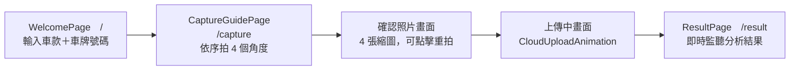
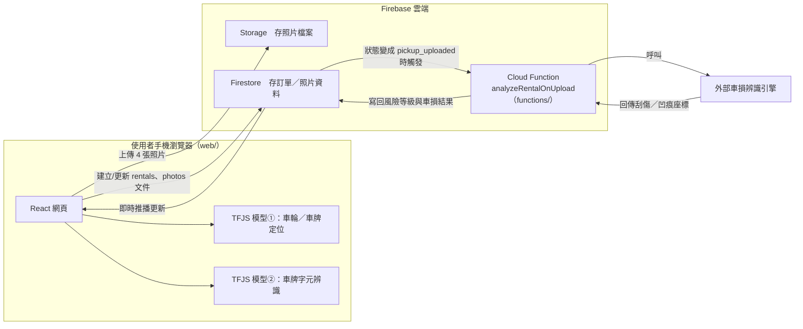
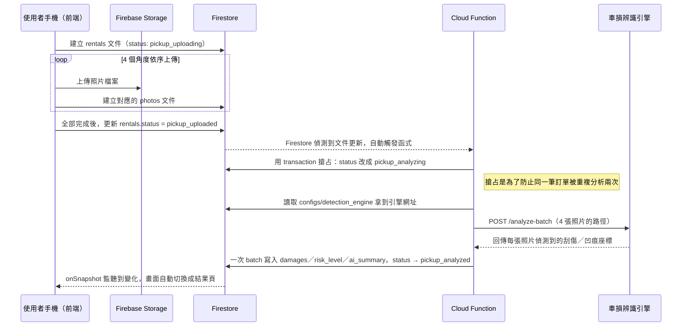
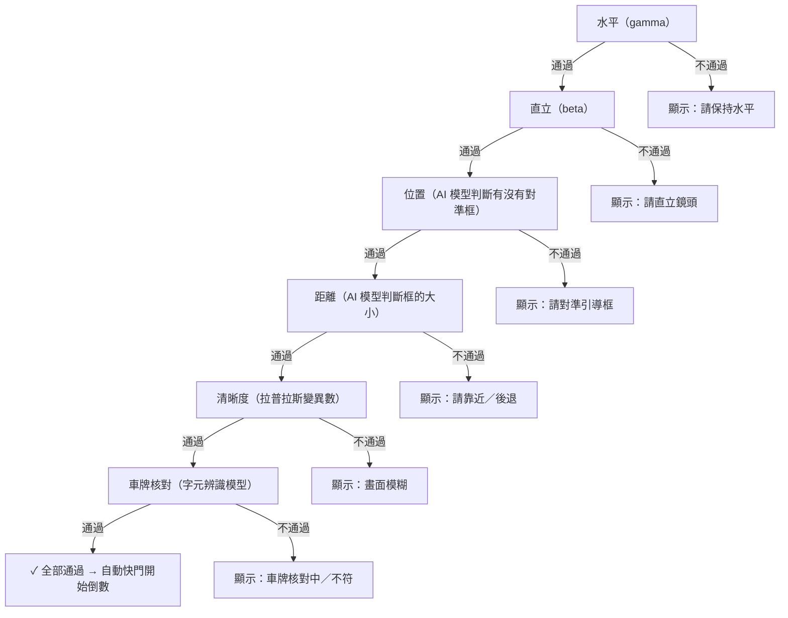
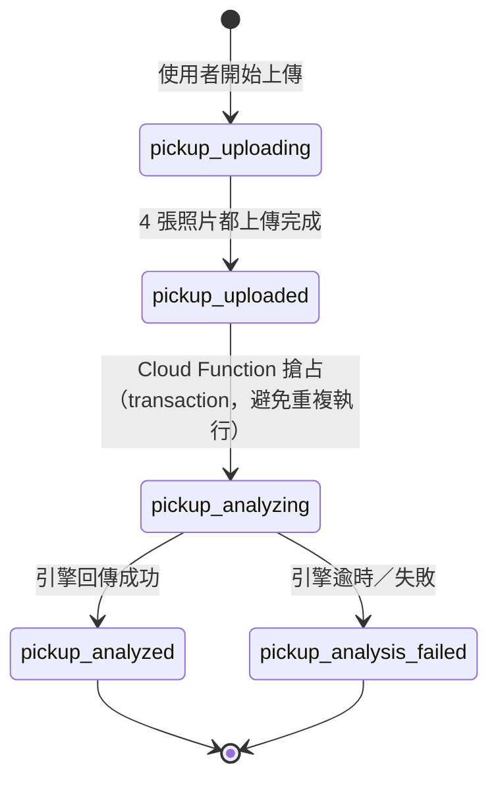

# 智能檢車｜開發歷程回顧：從規劃到現況（詳解版）

給用途：這是給自己看的技術筆記，記錄「原本照任務清單規劃的架構」跟「實際做出來的東西」之間差在哪裡、為什麼會差、怎麼調整的。跟 `PROGRESS_SUMMARY.md`（只記錄現況）不一樣，這份是有前因後果的敘事——不只寫「做了什麼」，更著重寫「為什麼在這個階段選這個技術」「這個技術是怎麼運作的」「用什麼方式開發出來的」「選這條路有什麼好處跟風險」，方便之後回顧「當初為什麼這樣做」，或跟別人口頭說明時有東西可以照著講、照著教。

因為我還在熟悉這些技術，內文會盡量寫得像教科書一樣，把專有名詞解釋清楚、盡量搭配生活化的比喻跟實際例子，不會預設你已經知道那些名詞在幹嘛。每個重大技術決策也會盡量列出「如果選另一條路會怎樣」的對照，這樣才看得出來「為什麼是這個選擇」，而不是只知道「結果選了這個」。

對照的規劃文件是 `智能檢車_開發任務清單與Prompt範本_審閱修正版.md`（以下簡稱「任務清單」），裡面把整個開發拆成任務 0~13。這份筆記就照這個任務編號一路走下來，每個段落會分成幾塊：**原規劃**（任務清單怎麼寫的）、**為什麼要用這個技術**（技術選型的道理跟替代方案比較）、**實際遇到的問題**、**現在怎麼做／怎麼開發出來的**、**好處與風險**。

---

## 整體架構是什麼

先講結論：這是一個「引導使用者用手機拍 4 張車輛照片、AI 自動判斷有沒有拍好、傳到雲端做車損辨識」的網頁 App（PWA，可以加到手機主畫面、像 App 一樣用，但本質是一個網站）。這種「租車/共享車輛交還時，系統自動比對交車前後的車況照片，抓出新增的刮傷凹痕」的應用場景，業界一般稱為 **vehicle condition inspection（車況巡檢）**，常見於租賃公司、共享汽車平台。

### 為什麼做成 PWA，不做原生 App

任務清單其實明講了「Phase 1 先做 PWA，Phase 2（任務 13）才考慮封裝成原生 App」，這個順序本身就是一個值得展開講的技術決策：

| | PWA（現在的做法） | 原生 App（iOS/Android 各自開發） |
|---|---|---|
| 開發成本 | 一套程式碼，手機/電腦瀏覽器都能開 | iOS（Swift）、Android（Kotlin）通常要各寫一份，或用 React Native/Flutter 這類跨平台框架折衷 |
| 更新方式 | 改完程式碼部署到伺服器，使用者下次打開網頁**自動拿到新版**，不用自己更新 | 使用者要手動去 App Store/Google Play 更新，舊版本可能長期存在 |
| 上架流程 | 不用上架審核，改完馬上上線 | 要送審，Apple 審核有時要等好幾天，被退件要重新排隊 |
| 安裝門檻 | 開網址就能用，「加到主畫面」是選配不是必要 | 使用者要先去商店下載安裝，安裝前的流失率通常比較高 |
| 原生硬體整合 | 能力有限，例如背景持續運作、部分感測器 API 支援度看瀏覽器 | 能直接呼叫作業系統原生 API，功能上限比較高 |
| iOS 特殊限制 | Safari 對 PWA 的某些權限 API（例如陀螺儀）處理方式比較龜毛，要多寫防呆（後面任務 3.5 會細講） | 原生開發沒有這層瀏覽器沙盒限制 |

這個專案現階段的重點是「快速做出可用的巡檢流程、驗證可行性」，PWA「改一次全部使用者都拿到新版、不用上架審核」這個特性，對「開發中頻繁調整」這個階段特別划算——這也是為什麼規劃文件把「封裝成原生 App」明確排到 Phase 2、等 Phase 1 穩定後才做：先用成本低、迭代快的方式把核心邏輯做對，值得投入雙倍成本做原生版本的時候，再做原生版本。

### PWA「看起來像 App」這件事，具體是靠什麼技術做到的

「加到手機主畫面、開起來像 App」不是瀏覽器自動幫你做的魔法，背後其實是兩個具體技術在支撐，這個專案的 `web/vite.config.ts` 就能直接對照看到：

- **`manifest.json`（應用程式資訊清單）**：一份描述「這個網站如果被加到主畫面，圖示、名稱、啟動方式該長怎樣」的設定檔。這個專案裡用 `vite-plugin-pwa` 這個 Vite 外掛，直接在 `vite.config.ts` 裡用 JavaScript 物件寫好 `manifest` 設定（`name: '智能檢車'`、`display: 'standalone'` 代表打開時不顯示瀏覽器網址列、看起來像獨立 App、`theme_color`／`icons` 決定圖示跟主題色），建置時外掛會自動把這份設定轉成一份真正的 `manifest.json` 檔案，瀏覽器讀到這份檔案，才知道「加到主畫面」之後要用什麼圖示、用什麼名稱顯示。
- **Service Worker（服務工作執行緒）**：瀏覽器背景常駐執行的一段 JavaScript，獨立於任何一個分頁存在，就算使用者把分頁關掉，它還是能繼續運作。它的角色像是網頁跟網路之間的一個「攔截層」——網頁發出的每個網路請求，理論上都可以先被它攔下來，由它決定「要不要用快取（cache，先前下載存起來的檔案）直接回應，還是真的發到網路上要」，這就是 PWA「離線也能開啟」「第二次打開明顯變快」的技術基礎。這個專案沒有自己手寫 Service Worker 程式碼，而是靠 `vite-plugin-pwa` 底層的 **Workbox**（Google 出的 Service Worker 工具庫，把「常見的快取策略」包裝成設定就能用，不用自己從頭刻）自動產生。

`vite.config.ts` 裡 `workbox.globIgnores` 這行設定，是這個專案在 Service Worker 快取策略上一個值得記錄的細節：

```ts
workbox: {
  // model 權重檔體積大，交由任務 11 的自訂預載邏輯處理，不納入 service worker
  // 的自動 precache 清單，避免安裝時強制下載全部資源
  globIgnores: ['model/**', 'char_model/**', '**/*.wasm', '**/*.traineddata*'],
}
```

Workbox 預設行為是「把建置出來的所有靜態檔案都在 Service Worker 安裝階段先下載快取好（**precache，預先快取**）」，這樣使用者第一次造訪之後，之後每次打開都優先吃快取、離線也能用。但這個專案的 AI 模型權重檔（`model/`、`char_model/` 資料夾）跟 wasm 執行檔體積不小，如果讓 Workbox 用同一套「安裝時全部強制下載」的邏輯處理，會變成使用者才剛打開網站，Service Worker 安裝階段就得先扛下載這幾個大檔案的流量，體驗上不划算——所以刻意把這幾類檔案排除在 Workbox 的自動 precache 清單之外，改交給任務 11 自己寫的「背景慢慢預載、給進度提示」那套邏輯去處理，兩套快取機制分工，不會搶著下載同一批檔案。

這也是為什麼即使拿掉這個設定 PWA 本身還是能運作——**manifest.json 決定「看起來像不像 App」，Service Worker／Workbox 決定「離線行為跟載入速度」，兩者是可以獨立調整的兩個維度**，這個專案對 manifest 幾乎照預設用法，但對 Service Worker 的快取範圍做了這一項刻意的客製化。

安裝與離線流程畫成圖大致是：

```
使用者第一次打開網站
        │
        ▼
瀏覽器下載 manifest.json，知道「加到主畫面」要用的圖示/名稱
        │
        ▼
Service Worker 安裝，Workbox 依照設定把靜態檔案（排除 model/wasm）precache 起來
        │
        ▼
使用者之後再打開（即使離線）
        │
        ▼
Service Worker 攔截網路請求 ── 命中快取就直接回應，不用等網路
```

### 為什麼 AI 模型要「前後端分工」，而不是全部放前端或全部放後端

架構上刻意把 AI 判斷拆成兩塊，這個分工是理解整個系統最重要的一件事：

- **前端（`web/` 資料夾，React + Vite 寫的網頁）**：跑兩個「輕量」AI 模型，一個負責「畫面裡車輪/車牌在哪」（物件偵測），一個負責「車牌上寫的是什麼字」（字元辨識）。這兩個模型是**直接下載到使用者手機瀏覽器裡執行**的，不是呼叫伺服器取得答案。
- **後端（`functions/` 資料夾）**：Firebase 的 Cloud Function（雲端函式，見下方名詞解釋）呼叫一個外部的「車損辨識引擎」，判斷照片裡「有沒有刮傷/凹痕」。這個判斷放在雲端做，不會塞進手機瀏覽器。

為什麼要這樣分？拆開來看兩種做法的取捨：

**在手機瀏覽器（前端）跑 AI 模型的好處與代價**

| 好處 | 代價 |
|---|---|
| 即時：拍照當下 0.幾秒就能給提示，不用等網路來回 | 手機的運算能力（尤其中低階機型）遠不如伺服器，模型不能做得太大太準 |
| 離線也能跑基本判斷（沒訊號時引導拍照還是能用） | 模型檔案要先下載到手機，佔用流量跟時間（這也是任務 11「資源預載」存在的原因） |
| 照片在「判斷角度對不對」這個階段完全不用上傳伺服器，對隱私比較友善 | 不同手機效能落差很大，同一個模型在新舊手機上的流暢度可能差很多 |

**在雲端（後端）跑 AI 模型的好處與代價**

| 好處 | 代價 |
|---|---|
| 可以用更大、更準的模型，不受手機硬體限制 | 一定要等照片上傳完、網路來回，有延遲，不可能做到「拍照當下就給結果」 |
| 運算資源集中在伺服器維護，模型要換版本，不用逼使用者重新下載 App/更新網頁快取 | 每次呼叫都要消耗雲端運算資源，使用量越大，成本越高 |
| 可以用比較「重」的分析（車損辨識本身需要的精確度比「有沒有拍正」高很多） | 使用者完全離線時，這一塊功能就是不能用 |

實際的分工邏輯是：**「拍照當下需要即時回饋的判斷」（拍歪了、太模糊、車牌對不對）放前端；「需要高準確率、可以容忍幾秒等待的判斷」（到底有沒有車損）放後端。** 這條分界線貫穿整個專案，後面任務 6、7（前端模型）跟任務 9（後端辨識結果）會分別詳細展開。

### 為什麼前端選 React + Vite

**React** 是目前最主流的前端 UI 框架之一，核心概念是把畫面拆成一個個可重複使用的「元件（component）」，畫面資料變了，React 會自動比對、只更新真正變化的那一小塊 DOM（瀏覽器裡的畫面節點），不用自己手動操作 DOM 更新每個地方——這對「拍照過程中畫面要頻繁根據 AI 判斷結果切換提示文字/框線顏色」這種互動密集的畫面特別合適。

**Vite** 是負責「開發時跑本機伺服器、把程式碼打包成瀏覽器看得懂的檔案」的建置工具，跟比較舊的 webpack 相比，Vite 開發模式下不用把整個專案先打包一次才能開始開發，而是利用瀏覽器原生支援 ES Module（一種 JavaScript 模組系統）的特性，隨開隨用、改一個檔案只需要重新處理那個檔案——對開發階段「改一行程式碼、馬上在手機瀏覽器看效果」這種高頻率的來回測試，體感速度差很多。

### 順便一提：`npm run dev` 打下去之後，背後到底發生了什麼事

React、Vite 這些工具本身都是用 JavaScript 寫的，但一般認知裡 JavaScript 是「瀏覽器裡的語言」——那開發時在終端機打的那些指令，到底是誰在執行？答案是 **Node.js**：一個讓 JavaScript 能夠離開瀏覽器、直接在作業系統上執行的執行環境（runtime）。瀏覽器裡的 JavaScript 負責操作網頁畫面（DOM）、回應使用者互動；Node.js 則負責讀寫檔案、啟動伺服器、執行命令列工具這類瀏覽器沙盒環境本來就不允許做的事——這個專案能夠打 `npm run dev` 或 `npm install`，靠的都是 Node.js 提供的這層能力，而不是瀏覽器。

**npm（Node Package Manager）** 則是 Node.js 內建的套件管理工具，負責把其他人寫好、公開發佈的程式庫（例如 React、TensorFlow.js）下載到專案裡，不用自己從零寫。這兩者的關係是：Node.js 是「執行環境」本身，npm 是「掛在 Node.js 底下、用來管理套件」的工具，兩者不是同一件事，只是幾乎總是一起出現。

打指令之後實際發生的兩條鏈路，各自畫成流程圖大致長這樣：

```
npm install
   │
   ▼
Node.js 讀取 package.json，列出需要哪些套件
   │
   ▼
把 React、Vite、TensorFlow.js 等套件下載進 node_modules 資料夾
```

```
npm run dev
   │
   ▼
Node.js 啟動 Vite 開發伺服器
   │
   ▼
Vite 把專案程式碼處理成瀏覽器看得懂的格式
   │
   ▼
瀏覽器打開 localhost，看到 React 畫出來的畫面
```

換句話說，Node.js／npm 本身不是這個網頁「跑起來給使用者用」的一部分——使用者最終在手機瀏覽器看到的東西，仍然是純粹的 HTML/CSS/JavaScript；Node.js／npm 的角色是「開發跟建置階段的工具鏈」，負責把原始程式碼組裝、打包成瀏覽器能直接執行的產出物。

### 把整個技術堆疊疊起來看：這個專案到底用了哪些技術、各自負責什麼

前面分別講了 Node.js／npm／Vite／React，也講了任務 6、7 的 TensorFlow.js／YOLO 模型，跟最前面「前後端怎麼串接」那一章的 Firebase。這些名詞單獨看都懂，但擺在一起常常會搞混「誰是誰的一部分」「誰負責什麼」。用一張最簡化的層次圖，由下往上疊起來看：

```
Node.js（JavaScript 執行環境）
        │
        ▼
Vite（開發/建置工具，跑在 Node.js 上）
        │
        ▼
React（前端框架，被 Vite 打包成瀏覽器看得懂的檔案）
        │
        ▼
瀏覽器（實際執行、顯示畫面給使用者看）
```

這四層只回答了「網頁本身是怎麼被組出來、送到瀏覽器」這件事，還沒講到 AI 模型跟雲端分析。把這兩塊接上去，完整版大致是：

```
Node.js
   │
   ▼
Vite
   │
   ▼
React ── 畫出 WelcomePage／CameraCapture／ResultPage 這些畫面
   │
   ▼
瀏覽器（使用者手機）
   │
   ├──▶ TensorFlow.js（AI 推論引擎，在瀏覽器裡執行，不呼叫伺服器）
   │        │
   │        ├─ 模型①：YOLOv8 Nano － 車輪／車牌位置定位（任務 6）
   │        └─ 模型②：YOLO11n － 車牌字元辨識（任務 7）
   │
   └──▶ 上傳 4 張照片、建立訂單資料
            │
            ▼
        Firebase（Firestore + Storage + Cloud Function）
            │
            ▼
        外部車損辨識引擎
            │
            ▼
        結果寫回 Firestore，畫面自動更新（onSnapshot）
```

看這張圖時抓住兩個重點就好：

1. **上半段（Node.js／Vite／React）只在「開發跟建置」的時候出現**，使用者最終打開網頁時，這幾個名詞已經完成任務、幕後退場了，瀏覽器裡真正在跑的是打包完的 HTML/CSS/JavaScript。
2. **下半段（TensorFlow.js／Firebase）才是使用者實際使用當下真正在運作的東西**，而且明顯分成兩條路：TensorFlow.js 那條完全留在使用者手機瀏覽器裡跑，不用等網路；Firebase 那條才需要上網、跑在雲端——這條分界線就是最前面「為什麼 AI 模型要前後端分工」那一節解釋的道理，這裡用同一張圖把「開發工具」跟「執行期技術」放在一起看，會更清楚每個技術名詞各自站在流程的哪個位置。

### 整體流程

流程大致是：使用者打開網頁 → 輸入車牌號碼 → 手機相機依序拍 4 個角度（左前/右前/左後/右後）→ 拍照過程中前端的兩個小模型會即時提示「拍歪了」「太模糊」「車牌對不上」之類的訊息，全部通過才會自動拍下去 → 4 張都拍完後上傳 → 雲端的車損辨識模型分析 → 結果畫面顯示哪裡有刮傷/凹痕。

畫面層面的流程圖：



前端跟雲端之間怎麼串起來的架構圖：



看這張圖時要注意：**兩個 TFJS 模型是在使用者手機瀏覽器裡跑的，不是呼叫伺服器取得答案**；真正比較重的「判斷有沒有車損」這個運算，才是在 Firebase 那一側（雲端）做。這個分工就是前面「為什麼 AI 模型要前後端分工」這一節解釋的邏輯。

---

## 前後端怎麼串接：一次完整的上傳到分析

上面的架構圖只畫了「誰跟誰有連線」，這裡把時間軸攤開，照實際發生的先後順序，把「按下確認上傳」到「畫面顯示結果」之間到底發生了什麼事講一遍，順便解釋為什麼選這種串接方式、跟另一種常見做法（前端直接呼叫 API 並等待回應）比起來差在哪裡。



### 為什麼選「事件觸發」而不是「前端直接呼叫 API」

一般網頁串接後端最常見的做法是：前端呼叫一支 API（例如 `POST /analyze`），伺服器處理完直接把結果當作這次 HTTP 請求的回應傳回來。這個專案沒有這樣做，而是改成「前端只負責把資料寫進資料庫，後端『盯著』資料庫的變化自己醒過來處理」，這種模式叫**事件觸發（event-driven / trigger）**。

用生活化比喻：直接呼叫 API 並等待回應，像是你去窗口辦事，站在櫃檯前面等承辦人員當場辦完才能走；事件觸發像是你把申請表投進信箱就可以先離開，承辦人員看到信箱有新申請單，自己排時間處理，處理完再通知你。

| | 前端直接呼叫 API（同步等待回應） | 事件觸發（現在的做法） |
|---|---|---|
| 好處 | 邏輯直覺、前端寫起來簡單 | 前端不用維持一個「等待中」的長連線，車損辨識這種比較花時間的運算，不會讓前端的請求一直掛在那裡等（尤其手機網路不穩定時，長時間掛著的請求很容易中斷失敗） |
| 好處 | — | 後端處理失敗要重試，不會影響前端已經完成的上傳動作——上傳跟分析是兩件事，責任分開 |
| 風險/代價 | 如果分析要花比較久時間，前端請求容易逾時（timeout）失敗 | 前端需要另外一套機制知道「後端到底處理完了沒」——這裡用的解法是 Firestore 的 `onSnapshot` 即時監聽（見下方） |
| 風險/代價 | — | 事件觸發機制本身有「至少送達一次」的特性（同一事件有小機率觸發兩次），需要額外處理重複執行的問題（見下方「搶占」） |

這個取捨背後的關鍵是：車損辨識這個運算不是「幾百毫秒」等級的，而是「幾秒到十幾秒」等級的（要上傳大圖、呼叫外部引擎、等它跑完模型），硬要前端「呼叫 API 後原地等待」風險比較高，改成「先存資料庫、後端自己接手、前端訂閱結果」對不穩定的行動網路環境更穩健。

### 逐段拆解

1. **建立訂單、上傳照片（前端主導）**：使用者按下「確認上傳」的那一刻，前端先在 Firestore（一種雲端資料庫，資料長得像一份份的 JSON 文件，不是傳統表格，見下方名詞解釋）建立一筆 `rentals` 文件，狀態標成 `pickup_uploading`。接著依序把 4 張照片傳去 Firebase Storage（純粹放檔案的地方，概念上像雲端硬碟），每上傳完一張，就在 `photos` collection 底下多建一筆對應紀錄。每個角度都有自己的完成旗標，重試時只補還沒成功的角度，不會建出重複資料——這個「逐張獨立記錄完成狀態」的設計，是為了應付行動網路上傳中途斷線這種常見情境：斷線重連後，不用整組 4 張重新上傳一次，只補沒傳成功的那幾張，對使用者的流量跟耐心都比較友善。

2. **狀態一改，雲端自動醒來**：4 張都傳完後，前端把 `rentals.status` 改成 `pickup_uploaded`。這是整條後端流程唯一的觸發點——`functions/` 裡用 `onDocumentUpdated` 這個 Firebase 函式註冊了一個 Cloud Function，專門盯著 `rentals` collection 的更新事件。程式概念上大致像這樣（示意，非逐字照抄原始碼）：

   ```ts
   // 概念示意：只要 rentals/{id} 這份文件被更新，這段函式就會被雲端自動叫醒執行
   export const analyzeRentalOnUpload = onDocumentUpdated('rentals/{id}', async (event) => {
     const after = event.data.after.data()
     if (after.status !== 'pickup_uploaded') return // 不是我們要處理的狀態變化，直接跳過
     // ...後面才是真正的搶占、呼叫引擎、寫回結果
   })
   ```

   這是「事件觸發（trigger）」的串接方式，跟一般「前端主動呼叫 API、等待後端回應」不一樣——前端寫完資料庫就沒事了，後端自己聽到動靜才醒過來處理。

3. **搶占，避免分析兩次**：雲端函式的觸發機制官方保證「至少送達一次（at-least-once）」，這是分散式系統常見的取捨——比起「保證剛好一次但系統設計複雜很多」，「保證至少一次、但由使用者自己處理重複」通常更簡單可靠。所以同一個事件有小機率會被觸發兩次。函式一開始先用 **transaction**（一段操作要嘛全部成功要嘛全部失敗，不會被插隊看到做到一半的狀態，詳見下方名詞解釋）把狀態從 `pickup_uploaded` 搶著改成 `pickup_analyzing`，第二次觸發時發現狀態已經不是 `pickup_uploaded` 了，就直接放棄不處理。這個「用一個狀態欄位當作鎖」的手法叫 **樂觀鎖（optimistic locking）** 的一種變形——不是真的去鎖住整份資料不給別人動，而是「誰先把狀態改成功，誰就贏，後來的人發現狀態不對就自己放棄」。

4. **呼叫真正做辨識的引擎**：搶到執行權後，函式讀一份存在 Firestore 裡的 `configs/detection_engine` 設定文件拿到引擎網址，把 4 張照片路徑 POST 給引擎的 `/analyze-batch`，引擎回傳每張照片偵測到的車損座標。**把網址存在資料庫而不是寫死在程式碼裡**，是常見的「設定與程式碼分離」做法——換一個辨識引擎網址（例如要切換到升級版的引擎），只要改一筆資料庫紀錄，不用重新部署一次程式碼。

5. **寫回結果，畫面自動更新**：函式算出風險等級、組出摘要文字，跟車損結果一次用 **batch**（把多筆寫入動作包成一次原子性操作一起送出，避免中途寫到一半失敗留下不完整資料）寫回 Firestore，狀態改成 `pickup_analyzed`。前端 `ResultPage.tsx` 從進頁面就用 `onSnapshot`「訂閱」這筆訂單資料——Firestore 的即時監聽功能，資料一變所有訂閱的畫面立刻收到最新版本，不用使用者按重新整理，前端也不用寫「每隔幾秒問一次好了沒」的**輪詢（polling）**邏輯。

   輪詢 vs. 即時監聽的差別值得展開：輪詢是前端主動每隔幾秒問一次「好了沒？」，即使還沒好也要一直問，浪費頻寬跟伺服器資源，而且「剛好問完、下一秒才好」的話，使用者要多等一個輪詢週期才會看到結果；即時監聽是後端資料一變，會**主動推播**給所有訂閱的前端，沒有「問的頻率」這個變數，理論上資料一寫入，畫面幾乎立刻更新，而且沒資料變化時完全不耗費額外流量。代價是即時監聽這種長連線技術對後端的實作複雜度比較高，但 Firestore 把這件事包好了，前端只要呼叫 `onSnapshot` 就能用，不用自己搭建 WebSocket 之類的即時通訊基礎設施。

**如果引擎掛掉或逾時**：任務清單原本沒規劃這個情境。實際做法是只要上面任何一步拋錯，函式會把照片標成分析失敗、訂單狀態改成 `pickup_analysis_failed`，前端看到會顯示「分析失敗，請稍後再試或聯繫客服」，不會讓使用者卡在「AI 分析中」畫面前面等到天荒地老。這個失敗狀態是規劃文件裡沒有的，是實作時另外加上去的——任何「呼叫外部服務」的地方都要假設外部服務有機率失敗，這是設計後端流程時的基本紀律，不能只設計「順利路徑（happy path）」。

---

## 任務 0～2：專案骨架、模型驗證、模型訓練

**原規劃**：Vite + React 骨架，裝 TensorFlow.js（跑 AI 模型用）、OpenCV.js（影像處理，例如判斷畫面清不清晰）、Tesseract.js（車牌文字辨識）三個套件；用 Roboflow 標註「車輪」「車牌」兩類物件、Google Colab 訓練 YOLOv8 Nano（一個很輕量的物件偵測模型架構），轉成瀏覽器看得懂的 TensorFlow.js 格式。

### 為什麼要用這些技術

**TensorFlow.js**：是 Google 做的、可以直接在瀏覽器（或 Node.js）裡跑機器學習模型的 JavaScript 函式庫。它的角色是「執行引擎」——模型本身不是用 TensorFlow.js 訓練的，而是先用 Python 生態系（見下方）訓練好，再轉換成 TensorFlow.js 看得懂的格式，放到網頁裡去「推論（inference，也就是拿訓練好的模型去做預測，不是訓練）」。選它的原因很直接：這是目前瀏覽器端跑深度學習模型最成熟、社群資源最多的方案，沒有其他明顯更好的替代品。

**Roboflow + Google Colab 訓練 YOLO 系列模型**：這是物件偵測模型開發的標準工作流程。
- **Roboflow** 是一個線上工具，讓你把蒐集來的照片一張張畫框、標註「這是車輪」「這是車牌」，並且能把標註好的資料集匯出成各種模型訓練框架看得懂的格式。
- **Google Colab** 是 Google 提供的免費雲端 Jupyter Notebook 環境，可以借用 Google 的 GPU（顯示卡，深度學習訓練需要大量平行運算，GPU 比一般電腦的 CPU 快非常多）來跑訓練程式，不用自己買一張昂貴的訓練用顯卡。
- **YOLO（You Only Look Once）系列** 是物件偵測領域很知名的一套模型架構，特色是「一次掃過整張圖就同時預測出所有框跟類別」（相對於更早期「先找候選區域、再一個個分類」的兩階段做法，速度快很多），Nano/n 版本是同系列裡參數量最少、跑起來最快、但準確率相對犧牲一些的版本，適合手機這種運算資源有限的裝置。

選擇「自己標註、自己訓練」而不是用現成的通用物件偵測模型，是因為「車輪」「車牌」這種特定類別的偵測，通用模型（例如訓練來認一般生活物品的模型）不會認識，一定要用專門蒐集、標註過的資料重新訓練。

### 現況

這幾個任務基本照規劃走，模型訓練/格式轉換也都驗證通過了。**但長期來看，最後兩個套件（OpenCV.js、Tesseract.js）其實都被拿掉了**——這是後面任務 7 那個大調整的源頭，詳見下面任務 7 的段落，這裡先只記結論：目前 `opencv.js` 雖然還裝著，但只有一個內部診斷頁面在用它做套件載入測試，正式功能已經不靠它了；Tesseract.js 則是完全被換掉，程式碼裡已經找不到了。

`src/platform/` 這個資料夾（任務清單裡標🅰️的部分，用意是把「呼叫手機相機/感測器」這類瀏覽器專屬功能都集中包成獨立的 **hook**——React 裡把「一段可重複使用的邏輯」包成一個函式的慣用手法，之後如果要把這個網頁封裝成手機 App，只要改這幾個檔案內部、不用動到其他畫面）**確實照規劃做了**，目前有 `useCameraCapture.ts`、`useSensorPermission.ts`、`useHapticFeedback.ts` 三個檔案在裡面，跟任務清單要求的一致。這是一種叫 **關注點分離（separation of concerns）** 的設計原則：把「跟瀏覽器/裝置耦合的細節」跟「畫面邏輯」分開放，換底層實作時，上層畫面程式碼完全不用動。

### 好處與風險

| | 好處 | 風險 |
|---|---|---|
| 自訓練模型（相對於找現成的通用模型） | 準確率針對這個場景最佳化，模型檔案可以做得比通用模型小（只認識自己需要的類別） | 需要自己蒐集、標註訓練資料，前期投入時間；模型的品質上限被訓練資料的質跟量綁住 |
| Google Colab 免費 GPU | 不用自己買訓練用顯卡，成本低 | 免費額度有使用時間/資源上限，長期大量訓練需求可能要考慮付費方案 |
| `src/platform/` 抽象層 | 未來要換底層實作（例如封裝成原生 App）時，理論上只改這幾個檔案 | 多一層抽象，對「現在只需要跑在瀏覽器」這件事本身沒有直接幫助，是為未來付的成本 |

---

## 深入探討：YOLO 模型從資料到部署的完整流程

這個專案裡實際用到**兩個各自獨立訓練的 YOLO 模型**：一個負責「車輪/車牌在畫面哪裡」（任務 6，2 個類別：`license_plate`、`wheel`），一個負責「車牌上每個字元是什麼」（任務 7，33 個類別，字母數字）。這一節把「這兩個模型是怎麼從一堆照片變成手機瀏覽器裡能用的東西」整段攤開講，刻意對應到統計基礎、AI 模型部署與應用、資料分析、資料探勘這幾塊知識——這個專案的實作過程其實就是這些課堂概念的具體案例。

### 一、資料蒐集與標註：資料探勘的起點

任何監督式學習（supervised learning，白話講就是「給模型看大量『題目＋正確答案』的配對，讓它自己找出規律」）模型，第一步都得先有「標註好答案的資料」，沒有這一步，後面的訓練無從談起。這個階段做的事情，本質上就是資料探勘課程裡「資料前處理／資料標註」這一塊：

- **蒐集原始素材**：車輛照片（用來訓練車輪/車牌定位模型）、裁切下來的車牌小圖（用來訓練字元辨識模型）。
- **人工標註（annotation）**：用 Roboflow 這個線上工具，一張張照片手動畫框、指定這個框是什麼類別。車輪/車牌模型只有 2 個類別，相對單純；字元模型則要在每一張車牌小圖上，把每一個字元各自框出來、標上正確的文字類別，工作量遠比 2 分類的框選任務繁瑣。
- **類別設計本身就是一種資料分析決策**：字元模型刻意排除了「4」（容易跟英文字母混淆）、「O」「I」（容易跟數字 0、1 混淆）、以及車牌上的「-」分隔符號，只留 33 個類別。這不是隨便省略，而是先分析「哪些字元組合在視覺上容易讓模型搞混」，把這些高混淆風險的類別排除在訓練目標之外，降低模型的分類難度、也減少了要標註的類別數量——這是資料分析裡「先理解資料的性質，再決定怎麼建模」的具體例子，而不是先建模型再事後硬修正。
- **類別平衡的考量**：標註資料時通常要檢查「每個類別的樣本數夠不夠、有沒有嚴重不平衡」（例如車牌上數字「0」出現的頻率，天生就可能比某些少見字母高很多）。樣本數過少的類別，模型學不到足夠的規律，之後辨識這個類別時準確率會特別差——這正是資料探勘/機器學習課程裡「類別不平衡（class imbalance）」這個常見議題的實務體現。

### 二、統計基礎：模型骨子裡到底在算什麼

YOLO 系列模型看起來是在做「框出物件」這件很直覺的事，但拆開來看，它同時在解兩種統計學上性質不同的問題：

- **迴歸（Regression）**：框的位置跟大小（中心點座標 cx、cy，寬 w、高 h）是連續數值，模型要「猜」出接近真實答案的連續數字，這是迴歸問題——跟課堂上教的「用身高猜體重」性質一樣，只是這裡猜的是四個數字組成的框。
- **分類（Classification）**：這個框裡的東西屬於哪個類別（是車輪還是車牌？是數字 3 還是英文 B？），是離散選項的分類問題。

YOLO 特別的地方是**同一個神經網路骨幹（backbone），同時輸出迴歸結果跟分類結果**，不是兩個獨立模型各做各的——這也是為什麼程式碼裡 `decodeYoloOutput`（`web/src/lib/yolo.ts`）看到的原始模型輸出是一個 `[1, 4+類別數, anchor數]` 的張量：前 4 個數字是框的迴歸結果（cx/cy/w/h），後面 N 個數字是這個位置屬於每個類別的分數，兩種問題的答案被塞在同一包輸出裡。

**信心分數（confidence score）本質上是一個機率估計值**，代表「模型有多確定這裡真的有一個物件、而且是這個類別」，不是絕對正確的答案。程式碼裡 `scoreThreshold` 預設值是 **0.25**——低於這個分數的框直接被丟棄，不會顯示出來。這個門檻值的設定，正對應統計/機器學習課程裡「決策閾值（decision threshold）」的概念：

- 閾值訂太低：雜訊、不夠明確的訊號也會被當成真的物件（統計上叫**偽陽性，false positive** 增加）。
- 閾值訂太高：真的存在的物件反而因為信心分數差一點沒到門檻而被濾掉（**偽陰性，false negative** 增加）。

這就是課程裡教的 **precision（精確率，抓出來的裡面有多少是真的）跟 recall（召回率，真的存在的東西裡有多少被抓出來）互相拉扯的取捨（trade-off）**——調整 `scoreThreshold` 這一個數字，實際上就是在這條 precision/recall 曲線上選一個操作點，沒有「絕對正確」的數值，只有「適合這個場景的取捨」。畫成一條軸線，兩端各自的代價一目了然：

```
scoreThreshold 拉低 ◀─────────────────────────────▶ scoreThreshold 拉高

雜訊也當成真的物件           真的存在的物件被濾掉
（false positive 增加）      （false negative 增加）
recall 高、precision 低      precision 高、recall 低
```

**IoU（Intersection over Union，交集除以聯集）** 是另一個核心統計量，公式很單純：兩個框「重疊的面積」除以「兩個框合起來涵蓋的總面積」，結果介於 0～1，數字越接近 1 代表兩個框越像在框同一個東西。畫出來大概是這樣：

```
        ┌──────────────┐
        │      A       │
        │      ┌───────┼──────┐
        │      │ 交集   │      │
        └──────┼───────┘      │
               │       B      │
               └──────────────┘

IoU = 交集面積 ÷（A 面積 + B 面積 − 交集面積）
```

這個專案的後處理用到 IoU 兩次：

1. **NMS（非極大值抑制，Non-Maximum Suppression）**：物件偵測模型常常對同一個真實物件，同時吐出好幾個位置相近、重疊很高的框。`decodeYoloOutput` 裡用 `tf.image.nonMaxSuppressionAsync` 搭配 `iouThreshold`（預設 **0.45**）——重疊程度超過這個門檻的框，只留信心分數最高的那一個，其餘視為重複框拿掉。這是模型輸出之後，**用統計方法「去重」** 的標準步驟，不是模型本身天生就只吐一個框：

   ```
   NMS 之前：同一個車輪被吐出 3 個互相重疊的框
     框①（信心 0.91）＋ 框②（信心 0.87，跟①重疊 0.8）＋ 框③（信心 0.79，跟①重疊 0.75）

   NMS 之後：只留信心分數最高、且互相重疊超過 iouThreshold 的框都被清掉
     只剩框①（信心 0.91）
   ```

2. **車牌字元框的模糊比對**（`usePlateOCR.ts` 的 `boxIou`）：判斷兩個字元偵測框是不是指向同一個字元位置，概念上跟上面 NMS 的用法一致，只是應用場景換了。

### 三、模型訓練：監督式學習的實際操作

模型訓練用的是 Google Colab（借用免費 GPU 運算資源）跑 Ultralytics 這套官方訓練框架（YOLO 系列模型最常用的訓練/推論工具鏈）。訓練的本質是一個不斷重複的迴圈：

1. 模型看一批（batch）標註好的圖片，「猜」出框的位置跟類別。
2. 用**損失函數（loss function）** 算出「猜的答案」跟「標註的正確答案」差多少——YOLO 系列的損失函數同時包含框位置的迴歸誤差（衡量猜的框跟正確框差多遠，常見會用到跟 IoU 相關的度量方式）跟類別分類的誤差（衡量猜的類別機率分布跟正確類別差多少，概念上類似統計學裡的交叉熵，cross-entropy——衡量兩個機率分布之間的落差）。
3. 用**梯度下降（gradient descent）** 的方式，根據這個誤差，一點一點微調模型內部的參數，讓模型下一次猜的更準一點。
4. 重複很多輪（每一輪掃過一次全部訓練資料，叫一個 **epoch**），直到模型的表現不再明顯進步。

訓練過程中另一個關鍵原則是把標註好的資料切成**訓練集**（真正拿來調整模型參數用）跟**驗證集**（訓練途中定期用來檢查模型表現，但這批資料模型從沒真正拿去調過參數）——這是為了偵測 **過擬合（overfitting）**：模型如果只是「死背」訓練資料的答案，在訓練集上表現會一直進步，但驗證集（模型沒看過的資料）表現卻停滯甚至變差，代表模型學到的是死記硬背，不是真正學會辨識的規律，這時候就要提早停止訓練或調整模型複雜度。這是機器學習統計基礎課程裡最核心的概念之一，這兩個模型的訓練同樣依照這個原則進行資料切分與驗證，確保模型學到的是能類推到新照片的規律，不是背answer。

（這部分實際訓練時的具體參數，例如切分比例、訓練輪數、資料增強手法，是在 Colab notebook 裡完成的，不在這個網頁專案的版控範圍內，這裡記錄的是遵循的方法論原則。）

### 四、AI 模型的部署與應用：從訓練環境到手機瀏覽器的完整鏈路

「訓練出一個準確的模型」跟「讓這個模型能在使用者手機瀏覽器上順利跑起來」是兩件完全不同難度的事，這一段是整個專案裡「部署」這門課題踩過最多坑、也最值得記錄的部分。

**1. 模型格式轉換**：訓練出來的模型原始格式是給 Python/PyTorch 生態系用的，要放進網頁瀏覽器執行，必須轉換成 TensorFlow.js 看得懂的格式——這是模型部署常見的「跨框架轉換」步驟。轉換過程中，類別名稱的「順序」是一個極容易踩雷但後果很嚴重的細節：模型輸出的永遠只是「第幾號類別」的數字索引，不是文字本身，前端程式要靠一份寫死的對照表（`web/src/lib/yolo.ts` 裡的 `CLASS_NAMES`／`CHAR_CLASS_NAMES`），把數字索引換算成人看得懂的文字。程式碼裡的註解特別強調這份對照表的順序「取自訓練時 Ultralytics 匯出的 `metadata.json` 的 `names` 欄位」且「不可調整」——如果這份對照表的順序跟模型訓練時內部的類別順序對不上，模型本身可能辨識得完全正確，但畫面顯示出來的文字會整組「答非所問」地錯位，而且不會有任何報錯訊息告訴你哪裡錯了，只會安靜地顯示錯誤答案。

**2. 前處理必須跟訓練時完全一致（letterbox）**：程式碼裡 `computeLetterboxLayout`／`drawLetterboxed` 這兩個函式，做的是把來源圖片「等比例縮放置中、其餘空間補黑邊」，讓圖片塞進模型要求的固定輸入尺寸，同時不改變物件原本的長寬比例。程式碼註解明講這是「對應資料集標註時採用的『Fit (black edges)』前處理」，如果偷懶直接把圖片「拉伸/壓扁」塞進固定尺寸，物件的長寬比例就會跟訓練資料當初標註時的比例不一致，模型準確率會無預警下降。兩種做法的差別畫出來一看就懂：

```
原始車牌（長方形）："ABC-1234"

方案一：直接拉伸/壓扁塞進正方形輸入（沒有做 letterbox）
┌────────────────────────┐
│      A B C - 1 2 3 4    │  ← 字元被橫向壓扁變形，
└────────────────────────┘     跟訓練資料標註時的比例對不上

方案二：letterbox（等比例縮放置中＋補黑邊，這個專案實際採用的做法）
┌────────────────────────┐
│████████████████████████│  ← 補黑邊
│      A B C - 1 2 3 4    │  ← 字元維持原本的長寬比例
│████████████████████████│  ← 補黑邊
└────────────────────────┘
```

這是模型部署階段一個很重要、也很容易被忽略的原則：**推論（inference）時的前處理方式，必須跟訓練時資料前處理的方式完全對應**，任何不一致（拉伸 vs. 補邊、正規化的數值範圍不同）都會讓模型「看到一種它訓練時從沒見過的畫面型態」，而且表面上程式完全不會報錯，只是準確率莫名其妙變差，很難察覺問題出在這裡。也正因為這個原則，車牌字元模型特地改用 **640x256** 這種貼近車牌實際長寬比的長方形輸入，而不是逼車牌硬塞進正方形——這樣可以減少補黑邊浪費掉的解析度，讓字元在輸入圖裡佔的比例更大、看得更清楚，車輪/車牌定位模型則維持正方形 640x640 輸入。

**3. 手動解析模型輸出（後處理，postprocessing）**：模型本身**只會吐出一堆數字**，不會自動告訴你「這裡有一個車輪、信心 92%」這種人看得懂的結論。`decodeYoloOutput` 這段程式碼要自己：把原始張量轉置、把 (中心點 x、中心點 y、寬、高) 換算成 (左上角、右下角) 座標、每個預測位置在所有類別分數裡取最大值當作信心分數並取這個最大值所在位置（`argMax`）當作類別、再對每個類別分別跑一次 NMS 去除重複框。這整段展示了一個部署工程的重點：**模型輸出只是原始數字，「這堆數字要怎麼變成應用程式能用的結論」，是部署工程師自己要寫的後處理邏輯，模型不會幫你做這件事。**

**4. 推論後端的選擇與效能取捨——這是最有故事性的一段實戰經驗**：TensorFlow.js 支援好幾種執行運算的「後端（backend）」，常見的有 **webgl**（借用手機/電腦的顯示卡圖形運算能力加速）跟 **wasm**（用 WebAssembly 技術在 CPU 上執行，見前面名詞解釋）。原本的設計邏輯是「優先嘗試 webgl，失敗了再降級用 wasm」，這是效能優先的合理設計——但實測後發現這個「偵測失敗再降級」的邏輯在部分手機上根本沒機會執行到：webgl 在某些手機上是**運算跑到一半才真正失敗**（原因是這個專案同時用到兩顆 YOLO 模型，兩者同時搶用手機 GPU 有限的紋理記憶體資源，資源衝突導致運算中途出錯），而這個失敗發生的時間點，比外層包住整段運算的 15 秒逾時保護還要晚——`Promise.race`（一種「讓兩個非同步工作賽跑，誰先有結果就先採用誰」的程式寫法）的邏輯下，逾時保護每次都搶先跳出來，把 webgl 真正丟出的錯誤訊息整個蓋過去，導致「偵測到 webgl 錯誤才切換成 wasm」這個原本設計好的容錯機制，實際上永遠沒有機會被觸發，每次都只看到「逾時」這個表面現象，一直卡在同一支手機的同一個問題上打轉，找不到真正的病灶。這段「兩個非同步流程賽跑、但誰先觸發完全是巧合」的競態情形，畫成時間軸大概是：

```
Promise.race([ webgl 推論, 15 秒逾時計時器 ])

時間軸： 0s ──────────────── 15s ────── 16s
webgl 推論：   運算中……運算中……          ✗ 這裡才真正出錯（GPU 資源衝突）
逾時計時器：                    ⏰ 15 秒先響

結果：Promise.race 先拿到「逾時」這個結果並回報 ── webgl 真正的錯誤（16s 那個 ✗）
      已經來不及被程式看到，容錯邏輯裡「偵測到 webgl 錯誤才切換 wasm」這條路永遠走不到
```

最後的解法是乾脆不賭「webgl 會不會撐過整段運算」，固定使用 wasm 後端。實測（在 Node.js 環境下）同一顆車牌字元模型，用 **cpu** 後端跑要 16 秒，用 **wasm** 後端只要 **0.4 秒**——對這兩顆模型的運算量來說已經夠快，而且不會被行動裝置當下的 GPU 資源競爭狀況影響，穩定性優先於「webgl 理論上可能更快」的可能性。

這是模型部署課題上一個很典型的教訓：**效能不是唯一的考量，「在各種裝置上都能穩定、可預期地運作」，往往比「理論尖峰效能」更重要**；而且「偵測到錯誤就自動降級」這種聽起來很合理的容錯設計，實務上要非常小心各種計時/**競態條件（race condition，多個非同步流程的執行先後順序不確定，導致結果跟預期不一致的現象）**細節，不然這個原本設計來保護系統的容錯機制，可能在特定情境下形同虛設，甚至讓你誤以為問題出在別的地方。

**5. 模糊比對：資料探勘概念在後處理階段的延伸應用**：拿到字元模型辨識出來的文字之後，跟使用者輸入的預期車牌號碼比對用的 `countMatchingChars` 函式，用的是一種**多重集合（multiset）交集比對**手法：先把「預期車牌號碼」裡每個字元各自出現幾次記錄成一張計數表，再逐一檢查「模型辨識出來的文字」裡的每個字元，計數表裡對應的字元還有沒有剩餘額度可以扣，扣得到就算配對成功一次，扣完就歸零不能重複用。這樣即使模型把字元順序讀錯、或多認/漏認一兩個字，只要「扣減後的總配對數」達到門檻（`MIN_MATCHED_CHARS = 5`，滿分 7 碼）就算通過。這種「不要求兩份資料完全一模一樣，而是量化兩者『重疊了多少』、再訂一個門檻決定算不算同一件事」的做法，概念上跟資料探勘/文字探勘課程裡常見的**集合相似度量測**（例如 Jaccard 相似度那一類手法的親戚）是同一種思路。門檻值 5/7 這個數字，也是根據「模型實際犯錯的頻率」實測調整出來的，不是憑空假設的理論值。

### 兩個模型的差異對照

| | 模型①：車輪/車牌定位（任務 6） | 模型②：車牌字元辨識（任務 7） |
|---|---|---|
| 類別數 | 2（`license_plate`、`wheel`） | 33（數字＋英文字母，扣除易混淆的 4/O/I） |
| 輸入尺寸 | 640×640（正方形） | 640×256（貼近車牌長寬比的長方形，減少黑邊浪費） |
| 用途 | 即時判斷拍攝角度/位置/距離對不對 | 拍照當下核對車牌號碼是否正確 |
| 後處理比對邏輯 | 純物件偵測（框＋類別），不需要額外的字串比對 | 框出的字元依 x 座標排序組字串，再用多重集合模糊比對 |

兩者共用同一套 `decodeYoloOutput` 後處理函式（呼叫時傳入各自的 `classNames` 參數），也共用同一套 letterbox 前處理邏輯跟 wasm 推論後端設定——這是一個「同一套底層工程基礎設施，套用到兩個不同任務」的實際範例，不用為每個模型各自重寫一套張量解析/前處理程式碼。

---

## 任務 3、3.5：相機權限與 iOS 感測器權限

**原規劃**：按鈕點下去才跳出相機權限請求（不能一進畫面就跳，會嚇到使用者也容易被拒絕）；相機比例用 `aspectRatio: { ideal: 16:9 }` 這種「建議值」而非「強制值」跟手機要，並且用 `track.getSettings()` 讀出手機實際給的比例，不要自己假設。另外因為 iOS 13 之後，Safari 瀏覽器要求「要讀陀螺儀資料前，必須先跳出一個權限請求對話框，而且這個請求一定要跟使用者的點擊動作綁在同一個時間點觸發」，所以任務 3.5 特別把這個 iOS 專屬的權限請求，塞進跟相機權限請求「同一次點擊」裡一起處理。

### 為什麼要這樣設計權限請求的時機

瀏覽器的權限系統（相機、麥克風、定位、感測器⋯⋯）背後有一個共通的安全設計理念：**權限請求必須是使用者主動觸發的動作所引發的結果**，不能由網頁「自己想跳就跳」。這是為了防止惡意網站一載入就轟炸使用者一堆權限彈窗，或者用使用者根本沒注意到的方式偷偷取得敏感權限。iOS Safari 對這件事要求特別嚴格——陀螺儀權限請求一定要在使用者點擊事件的「同一個呼叫堆疊（call stack）」裡觸發，晚一點點（例如點擊後先跑一段非同步邏輯才去要權限）瀏覽器就會直接拒絕，不會跳出對話框，這也是為什麼要「把相機權限跟陀螺儀權限包進同一次點擊」——如果分兩次按鈕分開要，使用者體驗上多一個步驟不說，陀螺儀那次如果沒設計好時機點，還可能直接要不到權限。

**用生活化比喻**：這就像銀行不會讓你「先簽一張空白同意書、之後系統自己決定什麼時候用」，一定要你當下親自按確認鍵，系統才能執行那個動作——而且 iOS 更嚴格，要求「按確認鍵」跟「執行動作」中間不能被打斷去做別的事，不然這次授權就當作沒發生過。

用同一次點擊事件、在同一個呼叫堆疊裡把兩個權限請求一次要到，畫成流程圖是：

```
使用者按下「開始拍照」按鈕
        │
        ▼
（同一個呼叫堆疊內，不能被其他非同步邏輯打斷）
        │
        ├──▶ 請求相機權限（getUserMedia）
        │
        └──▶ 請求 iOS 陀螺儀權限（DeviceMotionEvent.requestPermission）
                    │
                    ▼
        使用者同時看到／同意兩個權限對話框
```

如果中間夾了一段 `await` 呼叫其他非同步邏輯（例如先呼叫 API 查點什麼再要陀螺儀權限），陀螺儀那一支請求就會被「擠出」原本的呼叫堆疊，iOS Safari 會直接靜默拒絕、不會跳出對話框——這也是為什麼程式碼裡要特別小心，不能在兩個權限請求之間插入任何會讓執行流程「先跳出去等一下」的動作。

### 實際遇到的問題

相機的**畫面比例**這件事，實測後發現如果照規劃硬性指定 16:9 或後來考慮過的 9:16，部分手機會直接把鏡頭原本看得到的範圍「裁掉一部分」去湊這個比例（因為手機鏡頭原生的感光元件比例不一定是 16:9），畫面看起來像是被放大了，使用者實際能拍到的範圍反而變小，跟直覺不符。這是因為 `getUserMedia`（瀏覽器要求相機權限並取得畫面的 API）的 `aspectRatio` 約束，瀏覽器會盡量去湊這個比例，湊的手段就是裁切畫面——約束訂得越死，裁切幅度可能越大。

### 現況

相機比例**目前沒有指定任何 `aspectRatio` 約束**，直接用手機鏡頭原生預設的取景範圍（等於是規劃裡「用 `ideal` 而非 `exact`」這個保守做法又更進一步——連 `ideal` 都不強制指定了）。這個決定是實測過後刻意維持的，不是還沒做完。

iOS 感測器權限這塊倒是完全照規劃做了，跟相機權限包在同一個按鈕點擊事件裡處理，這個部分沒有繞路。

### 好處與風險

| | 好處 | 風險 |
|---|---|---|
| 不強制 `aspectRatio` | 使用者實際拍到的範圍等於鏡頭原生視角，不會有意外被裁切變窄的困惑 | 不同手機給出的畫面比例可能不一致，後面畫面排版（例如引導框疊圖）要能適應不同比例，不能假設固定比例 |
| 權限請求綁在同一次點擊 | 符合 iOS Safari 的嚴格要求，一次操作把兩個權限都要到，體驗上使用者只需要按一次 | 如果未來要在這個按鈕點擊流程中間插入其他非同步邏輯（例如先呼叫 API 檢查什麼），要非常小心別把陀螺儀權限請求「擠出」同一個呼叫堆疊 |

---

## 任務 4、5：提示優先權狀態機、陀螺儀防呆

**原規劃**：畫面同時只顯示「當下最需要處理」的一則提示，優先順序是「水平 > 直立 > 位置 > 距離 > 清晰度 > 車牌」——例如手機沒拿平的話，就只顯示「請保持水平」，不會同時跳出五六則提示轟炸使用者。陀螺儀部分：左右傾斜（gamma）超過 ±5 度就算沒拿平，前後傾斜（beta）沒有落在 70°~90° 之間就算沒拿直。

### 為什麼要用「狀態機」而不是同時顯示所有沒通過的條件

這裡用的設計模式叫 **有限狀態機（Finite State Machine, FSM）** 的簡化應用——把「使用者現在該做什麼」定義成一連串條件，每次只往下走到「第一個沒通過的條件」，前面通過的不用再顯示、後面還沒檢查到的也不用顯示。程式碼裡對應到一個叫 `useGuidanceStateMachine.ts` 的 hook，內部有一個 `PRIORITY_ORDER`（優先順序陣列）跟 `GUIDANCE_MESSAGES`（每個狀態對應的提示文字）。

為什麼不乾脆同時顯示全部沒通過的提示（例如同時顯示「請保持水平」+「請對準引導框」）？這是使用者體驗上的考量：**認知負荷（cognitive load）**——人在同一時間能有效處理的資訊量有限，尤其是「正在專心拿穩手機對準目標」這種需要專注力的當下，畫面同時跳出好幾條指令，使用者反而不知道要先做哪一個、容易來回搖擺，最後哪個都做不好。心理學上這類「一次只給一個明確下一步」的介面設計，一般會比「一次列出所有問題」更容易讓使用者順利完成任務。而且很多條件其實有因果關係——手機都還沒拿平，去看「有沒有對準引導框」這件事本身就沒有意義（框在畫面上的樣子會因為傾斜角度而扭曲），所以「照優先順序、一次只看一個」不只是體驗考量，邏輯上也比較合理。

### 陀螺儀（gyroscope）判斷的原理

手機裡的**陀螺儀/加速度感測器**能回報手機在三個軸向的旋轉角度，網頁透過 `DeviceOrientationEvent` 這個瀏覽器 API 讀取，主要用到兩個角度：
- **gamma**：手機左右傾斜的角度（想像手機平放在桌上往左或往右翹起的角度）。
- **beta**：手機前後傾斜的角度（手機從平躺 0 度，往直立方向轉，轉到完全直立面對前方大約是 90 度）。

判斷「有沒有拿平」看 gamma 夠不夠接近 0，判斷「有沒有拿直立對著車子」看 beta 夠不夠接近 90 度。

### 實際遇到的問題

1. **±5 度太嚴格了**。手機拿在手上本來就會有生理性的手抖，±5 度這個容錯範圍在真實情況下幾乎不可能穩定維持住，會讓使用者覺得「怎麼一直沒過」。這是一個很典型的「規劃時憑理論值設定門檻，實測才發現跟人手真實抖動幅度對不起來」的例子。
2. 陀螺儀在 beta 角度接近 90 度（也就是手機幾乎垂直立起來對著車子）的時候，遇到一個叫**「萬向鎖」（gimbal lock）** 的經典問題——這是描述 3D 旋轉角度的數學方式本身的限制：用三個獨立角度（yaw/pitch/roll，或這裡的 alpha/beta/gamma）描述三維旋轉，叫 **歐拉角（Euler angles）**，這套方法的先天缺陷是，當其中一軸轉到接近 90 度時，另外兩軸會失去獨立性、角度會變得很不穩定、甚至互相干擾，讀出來的數字會跳來跳去。用最早的物理起源來理解最直覺：機械陀螺儀是靠三層互相垂直的環架（gimbal）一層包一層，才能自由記錄三個軸向的旋轉——

   ```
   正常狀態（三個環架軸向互相獨立，各自能自由旋轉）：
   外環（yaw） ── 中環（pitch） ── 內環（roll）
      ↕ 獨立        ↕ 獨立           ↕ 獨立

   萬向鎖狀態（中環轉到 90 度，剛好跟外環、內環轉到同一個平面上）：
   外環（yaw） ══ 中環轉到 90° ══ 內環（roll）
      └────────── 兩軸疊在同一個平面，變得像同一個軸在動 ──────────┘
   ```

   當中間那一軸（對應到這裡的 beta）轉到 90 度附近，另外兩軸（alpha、gamma）在幾何上會疊到同一個平面上，等於少了一個獨立的自由度，計算出來的角度數字自然就會變得不穩定、跳來跳去。這不是感測器硬體故障，也不是手機真的在晃，是這套角度描述方式本身在特定角度附近會失真——常見的解法是換一種不會有這個問題的數學表示法（例如四元數 quaternion），或者像這裡一樣，針對容易觸發問題的角度區間，改寫判斷邏輯讓它不要單純依賴會失真的那個角度計算方式。

### 現況

容錯範圍大幅放寬——gamma 從 ±5° 放寬到 **±25°**，beta 的可接受範圍從 70°~90° 放寬到 **60°~95°**。萬向鎖問題也已經修正（讓判斷邏輯在角度接近臨界值時不會因為數學上的不穩定而誤判）。優先權順序、單一提示顯示這些邏輯設計本身跟規劃一致，沒有變。

六層優先權判斷鏈，同一時間只顯示「第一個沒通過」的那一則提示，後面幾層完全不會被檢查：



### 好處與風險

| | 好處 | 風險 |
|---|---|---|
| 優先權狀態機（一次只顯示一個提示） | 使用者永遠知道「下一步該做什麼」，降低認知負荷，操作路徑清楚 | 如果優先順序設計得不合理（例如把不重要的條件排在前面），使用者可能一直卡在某一關看不到後面真正影響拍攝品質的問題 |
| 放寬容錯範圍 | 大幅降低使用者「怎麼一直過不了」的挫折感，符合真實手持拍攝的生理限制 | 容錯放太寬，理論上可能讓「其實沒拍得很正」的照片也被判定通過，犧牲一部分拍攝品質換取可用性——這是一個要持續拿捏的平衡點，不是放越寬越好 |

---

## 任務 6：AI 視覺定位（車輪/車牌位置與距離判斷）

**原規劃**：模型跑出車輪/車牌的框之後，換算成「相對畫面的百分比座標」（不是死板的像素數字，這樣不同螢幕大小的手機都適用）。位置判斷：偵測到的框中心點座標，跟預先設定好的「目標位置」座標比對，差距太大就提示「請上移/下移」；距離判斷：偵測框佔畫面的面積比例，跟目標面積比，差距超過 10% 就提示「請靠近/後退」。

### 這個模型是怎麼運作的

任務 0~2 訓練出來的 YOLO 系列物件偵測模型，丟進一張照片，會回傳一組「框」，每個框有四個數字（框的位置跟大小）跟一個類別標籤（這是車輪還是車牌）跟一個信心分數（模型有多確定這是對的）。前端 `CameraCapture.tsx` 這個元件會**每隔固定時間（節流，throttle，見下方）**抓一張目前鏡頭畫面丟進模型，拿到框之後，換算成畫面的相對百分比座標——用百分比而不是像素，是因為不同手機螢幕解析度不一樣，用像素數字沒辦法直接套用到所有裝置，用「佔畫面寬高的百分之幾」才是跨裝置通用的表示法。

**節流（throttle）** 是為什麼存在：模型每跑一次都要吃運算資源，如果每一個畫面更新（瀏覽器通常一秒更新畫面 60 次）都跑一次模型，手機會很快過熱、耗電飆升、畫面也會卡頓。所以會限制「模型最多多久跑一次」，在「即時性」（多久才更新一次判斷）跟「效能」（手機負擔多重）之間抓一個平衡點。

### 為什麼位置判斷邏輯後來改掉了

**原規劃**：偵測框中心點座標，跟一個固定的目標座標比對，差距在容錯值（8%）內算通過。

**實際遇到的問題**：跟任務 5 類似的狀況——**距離的 10% 容錯範圍太嚴格**，真人手持拍攝很難剛好落在窄窄的 10% 區間內。另外位置判斷原本用「中心點座標差距是否小於一個固定的容錯值」，這個做法有個問題：**畫面上顯示給使用者看的引導框（虛線方框），跟系統內部拿來判斷『對準了沒』的容錯邏輯，是兩套完全獨立的東西**——不管畫面上引導框畫得多大多小，容錯範圍永遠是同一個固定百分比數字，跟使用者實際「看畫面覺得自己對準了」的直覺感受對不太起來。舉個例子：如果引導框在畫面上看起來蠻大一格，使用者會覺得「車輪只要進到框裡看起來就對了吧」，但固定 8% 中心點容錯這套邏輯，可能因為車輪中心點跟框中心點差了那麼一點點（即使車輪整個都還在框內），還是判定沒通過——這種「畫面看起來明明對了、系統卻說不對」的落差，是純粹用抽象數字做判斷、沒有跟視覺呈現綁在一起才會出現的問題。

### 現況

- 距離容錯從 10%（規劃值，中途曾經先放寬到 40%）再進一步放寬到 **60%**。
- 位置判斷邏輯整個換掉，改成「偵測框的中心點，是不是真的落在畫面上那個虛線引導框的範圍裡面」——**這是關鍵的修正**：讓「畫面上看起來對準了沒」（視覺呈現）跟「系統判斷通過了沒」（背後邏輯）用同一套依據，而不是兩套各算各的數字。使用者用眼睛看畫面就能預期會不會通過，不會有「畫面上看起來明明對準了、但系統說沒過」的落差感。這個修正背後的原則是：**任何會讓使用者「靠感覺判斷」的介面，背後邏輯就該跟那個「感覺」用同一套依據去算，不要讓使用者看到的畫面暗示跟系統實際判斷標準是兩件事。**新舊兩種判斷邏輯畫成圖對照：

  ```
  舊邏輯（比中心點距離）：           新邏輯（比是否落在框內）：

  ┌ ─ ─ ─ ─ ─┐                     ┌ ─ ─ ─ ─ ─┐
  │          │                     │   ●車輪   │  ← 車輪中心點在框內，
  │     ●車輪 │← 車輪中心點偏一點， │  中心點   │     即使偏一點也算通過
  │    ╳目標  │   跟目標點距離      └ ─ ─ ─ ─ ─┘
  └ ─ ─ ─ ─ ─┘   超過 8% 容錯，
                 判定「沒通過」──    使用者看畫面覺得「車輪整個都在框
                 但畫面上看起來        裡，應該算對準了」，跟系統判斷
                 明明已經對準了        的依據終於一致
  ```

- 引導框的座標系統本身有一個額外的省工技巧：因為車子左右兩側基本上是**鏡像對稱**的，右前/右後的引導框座標直接用左前/左後的座標鏡像算出來（也就是 `x' = 100% - x`），不用四個角度各自重新校正一次。這是善用「物理世界的對稱性」減少一半重工的常見手法，畫出來就是把左側角度的引導框座標，直接沿著畫面中線翻過去：

  ```
  左前（校正過的原始座標）        右前（鏡像算出來，不用重新校正）

  ┌──────────────┐              ┌──────────────┐
  │  ┌──┐        │              │        ┌──┐  │
  │  │框│        │   x' = 100%-x │        │框│  │
  │  └──┘        │  ───────────▶│        └──┘  │
  │  （x = 20%） │              │  （x' = 80%）│
  └──────────────┘              └──────────────┘
  ```

### 好處與風險

| | 好處 | 風險 |
|---|---|---|
| 用相對百分比座標（不是像素） | 一套邏輯適用所有螢幕解析度，不用為不同裝置各寫一份判斷邏輯 | 如果手機鏡頭的實際可視範圍跟畫面呈現比例不一致（見任務 3 的裁切問題），百分比座標可能對不上真實拍攝範圍，這也是為什麼任務 3 決定不強制 `aspectRatio` |
| 位置判斷改成「框是否落在引導框內」 | 視覺呈現跟判斷邏輯一致，使用者體感更順 | 「落在引導框內」這個條件比單純比較中心點距離運算量稍微複雜一點點（要判斷包含關係），但差異在效能上可忽略 |
| 鏡像座標省工 | 少寫一半的座標校正工作，且左右角度的容錯邏輯天生保證對稱一致 | 前提是車輛本身真的左右對稱，如果之後要支援某些左右外型不對稱的特殊車型，這個假設會不成立 |

---

## 任務 7：畫質檢驗與車牌辨識——這是整個專案架構偏離規劃最多的地方

這個任務原本規劃的做法幾乎整套被換掉了，值得詳細記一下前因後果，因為這是整個開發過程裡「規劃 vs. 實測」落差最大、最值得學到教訓的一段。

### 畫質（模糊）偵測

**原規劃**：用 OpenCV.js（一個很成熟、功能很齊全的電腦視覺函式庫，C++ 寫的 OpenCV 專案的網頁版本）內建的「拉普拉斯變異數」演算法算清晰度。

**這個演算法的原理（白話講）**：拉普拉斯運算子是影像處理裡專門用來凸顯「邊緣」的一種數學運算——把圖片的每個像素，跟它周圍鄰居的像素值做一個固定公式的加減運算（技術上叫**卷積，convolution**，用一個小的 3x3 數字矩陣，在整張圖上滑動計算），如果一塊區域顏色都差不多（例如一片模糊的天空），運算出來的值會接近 0；如果是銳利的邊緣（例如對焦清楚的車體輪廓線），運算出來的值會有很大的正負跳動。把整張圖算完拉普拉斯運算後，去看這些數值的**變異數（variance，統計學上衡量一組數字「離散/分散程度」的指標）**——邊緣越銳利越清楚的照片，這些數值忽高忽低跳動幅度越大，變異數就越高；整張都糊糊的照片，數值都差不多，變異數就低。所以「變異數高低」可以間接當成「這張照片對焦清不清楚」的指標，這是電腦視覺領域一個很經典、簡單但實用的無需訓練模型的清晰度判斷法。

**實際遇到的問題**：OpenCV.js 這個套件雖然功能強，但它是用 C++ 寫的函式庫、透過 **WASM（WebAssembly，一種讓瀏覽器可以跑非 JavaScript 語言編譯出來的程式碼的技術，見下方名詞解釋）** 包成網頁能用的版本，整包檔案體積高達 **15MB 以上**。而這裡實際只需要用到它裡面「拉普拉斯變異數」這一個很單純的運算，為了這一個小功能背 15MB 的下載量，比例上很不划算，尤其考慮到使用者是在手機、可能還是行動網路的情況下使用——這是一個很典型的「為了一個小功能扛一整個重量級函式庫」的反面案例，工程上有個說法叫 **「為了打蒼蠅動用大砲」**。

**現況**：拉普拉斯變異數這個演算法本身的數學邏輯不難（就是拿一張圖，跟一個固定的 3x3 小矩陣做卷積運算，算出結果的變異數），改成**自己用純 JavaScript + Canvas 重寫一遍**，不透過 OpenCV.js。`Canvas` 是瀏覽器原生就有的 2D 繪圖 API，可以讀出一張圖片每個像素的顏色數值（`getImageData`），有了像素數值陣列，剩下就是純數學運算，不需要額外的重量級函式庫。功能一樣、判斷邏輯一樣，只是不用背那 15MB 的套件下載了，實作上大約落在 `lib/sharpness.ts` 這個檔案裡（純函式，沒有外部依賴）。

另外還發現一個實務上的細節問題：使用者放開手、手機剛停下來的那個瞬間，鏡頭可能還在自動對焦、還沒真的清晰，如果只靠背景每 200ms 量一次的舊數值來決定要不要拍，會抓到「剛好上一次量測時還算清晰，但真正按下快門那一刻其實還沒對好焦」的空窗期——所以現在快門真正觸發前，還會**額外對當下那一影格重新測一次清晰度**，沒過的話取消這次拍攝，不是只信任舊數據。這是「不要只信任快取/舊資料，關鍵動作前重新確認一次最新狀態」的防呆設計。

### 車牌辨識（這是最大的架構改動）

**原規劃**：用 Tesseract.js（一個通用的網頁端文字辨識套件，只載入英文語言包，因為台灣車牌沒有中文字）去讀車牌上的文字，跟一個「預期車牌號碼」比對是否相符。而且規劃文件裡明確把「這個預期車牌號碼到底從哪裡來」列為一個**還沒解決、會卡住任務 7 元件設計的阻塞性問題**（規劃文件「待確認事項」第 2 點）。

**Tesseract.js 是什麼**：這是 Google 開源的 **OCR（Optical Character Recognition，光學文字辨識）** 引擎 Tesseract 的 JavaScript/WASM 移植版，設計目標是辨識「一般印刷文件、書籍掃描」這類比較工整、正對鏡頭、字體標準的文字，是網頁端最知名、最容易取得的通用 OCR 方案之一。

**實際遇到的問題**：Tesseract.js 是設計來讀「一般印刷文字」的通用型 OCR，車牌是一種特殊字體（車牌字體通常經過設計、跟一般印刷字體不同）、拍攝角度歪斜、光線反光、車牌本身可能有髒污或些微變形都很常見的場景，通用型 OCR 在這種條件下準確率不夠穩定——這也正是規劃文件自己在「待確認事項」裡就已經預先提醒過的疑慮（"OCR 辨識準確率在瀏覽器端通常不如預期"），算是規劃階段就有的合理擔憂，實測後證實確實如此。

### 深入一點：Tesseract 具體會在哪些地方翻車？

「通用型 OCR 準確率不夠穩定」講得比較籠統，實際上拆開來看，會踩到的雷通常是好幾種情況疊在一起，不是單一原因造成的：

- **裁切下來的車牌解析度太低**：即使做完灰階化、提高對比、二值化（把畫面只留黑白兩色，讓文字邊緣更銳利的前處理手法）這幾道前處理，如果裁切出來的車牌小圖原本只有例如 90×25 像素，二值化之後解析度還是只有 90×25，每個字元可能只佔 10~15 個像素高，OCR 引擎本來就很難辨認——常見的補救做法是把裁切出來的小圖再放大 2～4 倍（例如 90×25 放大成 360×100）之後才送進辨識，因為放大不會補回真正遺失的細節，但至少讓引擎「看得到」的像素數量足夠，辨識率通常會有明顯改善。
- **物件偵測框切得太緊或太鬆**：如果框剛好裁掉車牌某個字元的邊角，OCR 少看到一個字元，整組號碼就容易連帶認錯；反過來框裡如果留了太多車牌以外的背景（例如保險桿），背景雜訊也會拉低辨識率。實務上常見的做法是在框的外圍再留 5～10% 的邊界，確保整個車牌完整保留、又不留過多背景。
- **台灣車牌的字體、格式跟中間的「-」符號**：Tesseract 是設計來讀一般文件的通用 OCR，沒有額外設定的話，容易把車牌中間的「-」符號認成別的字元、或把外觀相近的字元認混（例如英文字母 O 跟數字 0、英文字母 I 跟數字 1）。常見的解法是設定 **character whitelist（字元白名單）**——直接告訴 Tesseract「這次辨識結果只可能是這些字元：`ABCDEFGHIJKLMNOPQRSTUVWXYZ0123456789-`」，縮小猜測範圍，降低誤判成白名單以外字元的機率。
- **PSM（Page Segmentation Mode，頁面分割模式）沒有調整**：Tesseract 預設會假設「這是一整頁文件」，用整頁文件排版的邏輯去找文字區塊；但車牌裁切下來通常只有一行文字，這種情況下把 PSM 改成「單行文字（single text line）」模式，通常比預設模式的準確率好很多——這是很多人套用 Tesseract 時容易漏掉的一個參數，光是這項設定沒調對，就足以拉低整體辨識率。
- **反光**：車牌本身是反光材質，如果原始照片在字元中間剛好有一大片反光，二值化之後那塊反光範圍會整片變成白色，等於那幾個字元的筆畫細節已經永久遺失——這種情況不管 OCR 引擎再強、參數再怎麼調整，都不可能「無中生有」把已經遺失的資訊救回來，只能從源頭（拍攝當下的角度、光線）去避免。

這幾點也解釋了為什麼這個專案的重點會放在「引導使用者怎麼拍」（見任務 3～6，角度／距離／清晰度的即時提示），而不是一路在 OCR 端調整參數：**如果能在拍照當下就確保車牌夠大、夠正、沒有反光，很多 OCR 端的問題根本不會發生，這比事後想辦法從一張先天條件就不好的照片裡搶救資訊，效益要高得多。**

### OCR 除了 Tesseract.js，還有哪些選擇？為什麼沒有換另一套現成的 OCR

OCR 領域除了 Tesseract 之外，常見的選擇大致可以分成三類：

| 分類 | 代表方案 | 優點 | 缺點 |
|---|---|---|---|
| 傳統規則式 OCR | Tesseract.js | 免費開源、可離線執行、可在瀏覽器直接執行、容易整合 | 對車牌這類特殊場景辨識率普通，對模糊、反光較敏感 |
| 深度學習 OCR | PaddleOCR、EasyOCR | 辨識率通常比 Tesseract 高，對傾斜文字的容錯度較好 | 主要生態在 Python／伺服器端，要在瀏覽器直接執行相對困難 |
| 雲端 OCR API | Google Vision OCR、Azure OCR、Amazon Textract | 辨識率高、對複雜場景表現好，不用自己維護模型 | 需要網路連線才能呼叫，有延遲跟費用，超過免費額度需要付費 |
| 專門車牌辨識（ALPR，Automatic License Plate Recognition） | OpenALPR、HyperLPR、Plate Recognizer | 專門為車牌場景設計，辨識率通常比通用 OCR 高很多 | 同樣多半是伺服器端方案，不是設計給瀏覽器直接執行 |

對照這個專案既有的架構限制（PWA、希望核心判斷都留在使用者手機瀏覽器裡完成、不依賴額外的伺服器呼叫，見最前面「為什麼 AI 模型要前後端分工」那一節），上面這幾類裡除了 Tesseract.js 之外，其餘幾乎都需要網路連線或伺服器端執行環境，等於違背了「前端輕量模型即時判斷、不用等網路來回」這條既有的架構原則。這正是為什麼專案沒有選擇「換一套更準的雲端 OCR」，而是選擇「自己訓練一個專門辨識車牌字元的物件偵測模型、繼續留在瀏覽器端執行」——這個決定本質上跟前面挑選 YOLO Nano、放棄 OpenCV.js 是同一種取捨邏輯：**在「必須留在瀏覽器端執行」這個架構前提之下，客製化一個小而準的專用方案，通常會比套用一個更強大、但體積或執行環境不適合瀏覽器的通用方案更划算。**

**現況**：整個換成**自己額外訓練一個專門辨識車牌字元的物件偵測模型**（YOLO11n 架構，比任務 0~2 用的 YOLOv8 Nano 更新一代，同樣是輕量版本，33 個類別，對應 0-9 扣掉容易跟英文字母搞混的「4」、A-Z 扣掉容易跟數字搞混的「O」「I」，也不含車牌上的「-」分隔符號——這幾個字元刻意不訓練，是為了減少模型混淆同時降低訓練標註的工作量）。

**這個做法的原理跟前面 Tesseract.js 的做法本質上不同**：Tesseract.js 是「文字辨識」思維——把整段文字當成一個要解讀的序列去讀；換掉之後的做法其實是「物件偵測」思維——把車牌上**每一個字元都當成一個獨立的物件去框出來、各自分類是哪個字**，概念上跟任務 6 拿來抓車輪/車牌位置的模型是同一套技術（都是 YOLO 系列物件偵測），只是這次偵測的目標從「車輪/車牌在哪裡」換成「這個字元是 A 還是 B 還是 8」。兩種思維畫成流程圖對照：

```
Tesseract.js 的思維（整段文字當一個序列讀）

  車牌小圖
     │
     ▼
  辨識整排文字
     │
     ▼
  輸出："ABC-1234"
```

```
現在的思維（每個字元都是一個獨立物件）

  車牌小圖
     │
     ▼
  YOLO11n 字元偵測模型
     │
     ▼
  框出每一個字元＋各自分類是哪個字
     │
     ▼
  依左右 x 座標排序組成字串
     │
     ▼
  輸出："ABC-1234"
```

運作方式是：把車牌裁下來的小圖丟進去，模型把每一個字元各自框出來、各自判斷是哪個字，再依照框的**左右 x 座標排序**，組成完整車牌號碼字串。

比對邏輯也跟著調整：原本設想比較接近「整串字完全比對」，現在改成**模糊比對**——只要辨識出來的字元裡，有**至少 5 個字元**（滿分 7 碼，台灣車牌常見格式是 3 碼英文+4 碼數字）跟預期車牌號碼對得起來（不要求順序、不要求長度完全一樣），就算通過。這樣可以容忍模型偶爾認錯一兩個字元、或多認/漏認一兩個字元的情況，不會因為單一個字認錯就整個判定失敗——這是典型的「容錯設計（fault tolerance）」思維：與其追求「模型永遠 100% 準確」（不切實際），不如設計一套「允許小幅度誤差還是能正常運作」的比對機制。

規劃文件裡提到的那個「阻塞性問題」——`expectedPlateNumber`（預期車牌號碼）到底從哪裡來——**已經解決**：現在是使用者在拍照前的首頁畫面上，自己手動輸入車牌號碼（目前是測試性質的輸入框，還不是接真正的車輛查詢系統，這部分列在後面的待辦裡）。

另外規劃文件也提過「車牌透視校正（perspective correction）」——因為拍攝角度歪，車牌看起來會變成梯形而不是長方形（這在影像處理裡叫**透視變形**），理論上先用數學方法把梯形「拉正」成長方形再辨識，準確率應該會更好——這個做法**實際試過但後來放棄了**，確認新版的字元偵測模型準確率已經夠高，不需要多這一道校正手續（多一道處理，理論上會增加辨識前的等待時間跟出錯機會，是「簡單有效就不要為了理論上更完美而增加複雜度」的取捨）。

兩條路徑對照：

| | 原規劃 | 現況 |
|---|---|---|
| 1 | 裁切車牌區域 | 裁切車牌區域（留 12% 邊界） |
| 2 | 丟進 Tesseract.js（通用文字 OCR） | letterbox 成 640x640（見下方名詞解釋） |
| 3 | 讀出一整排文字 | 丟進自訓練 YOLO11n 字元偵測模型 |
| 4 | 跟預期車牌完全比對 | 逐一框出每個字元＋各自分類 |
| 5 | — | 依 x 座標排序組成字串 |
| 6 | — | 跟預期車牌模糊比對（≥5/7 字元相符） |

### 為什麼任務 11（資源預載）也跟著變了

因為任務 7 把 OpenCV.js（拿掉）跟 Tesseract.js（換掉）都動了，任務 11 規劃要「預先在背景載入 OpenCV.js 跟 Tesseract.js」這件事，目標自然也就跟著換成「預先載入任務 6 跟任務 7 現在實際在用的兩個 TensorFlow.js 模型」（車輪/車牌定位模型＋車牌字元辨識模型）。背景預載、進度顯示這些原本的設計精神有保留（讓使用者一進網頁就開始下載模型，等真正要拍照時模型早就緒了，不用臨拍照才現場下載卡住），只是預載的「東西」換了。

### 好處與風險

| | 好處 | 風險 |
|---|---|---|
| 自己重寫拉普拉斯變異數（拋棄 OpenCV.js） | 少了 15MB 依賴，網頁載入速度跟流量消耗大幅改善 | 自己寫的實作要對演算法原理有正確理解，出錯了不像用成熟函式庫那樣有社群幫忙抓 bug |
| 自訓練字元偵測模型（拋棄 Tesseract.js） | 準確率針對「車牌」這個特定場景最佳化，比通用 OCR 更適合這個任務 | 需要額外的訓練資料蒐集/標註成本，模型準確率的天花板取決於訓練資料涵蓋了多少種拍攝角度/光線情境，日後遇到新的邊緣情境（例如特殊材質車牌、車牌框遮擋）可能要重新蒐集資料補訓練 |
| 模糊比對（≥5/7 字元相符） | 容忍模型小幅誤判，不會因為一兩個字元認錯就整個卡住流程 | 容錯門檻設太寬，理論上可能誤判到另一台車牌很相近的車，需要在「使用者體驗順暢」跟「辨識嚴謹度」之間拿捏 |
| 放棄透視校正 | 少一道處理步驟，速度更快、複雜度更低 | 如果之後遇到拍攝角度特別刁鑽的情境，準確率可能會比有做校正時差，這是已知但目前判斷可接受的取捨 |

---

## 任務 8：自動快門

**原規劃**：手機靜止判定（陀螺儀角速度低於 3°/秒，持續 1 秒）通過、且前面所有條件都過關後，用一個圓形進度圈動畫填滿代表倒數，填滿就自動拍照＋震動＋音效。如果使用者手一直抖、15~20 秒都沒辦法觸發，要提供手動快門逃生。

### 為什麼要做「自動快門」而不是單純讓使用者自己按快門

如果條件都通過了還要使用者自己看畫面再按一下快門，「按下去」這個動作本身的手部施力，很容易讓手機在按下瞬間輕微晃動，反而讓一張原本已經對準、清晰的畫面，在按下快門那一瞬間被自己的手抖破壞掉——這是相機/攝影領域一個常見的問題（專業攝影常用快門線或遙控器就是為了避開這個問題）。自動快門讓系統在「偵測到條件都通過、而且手機已經穩定不動」的那個時間點自動觸發，避開使用者手動按壓造成的晃動。

「震動 + 音效」則是給使用者一個明確的**回饋（feedback）**，告訴他「剛剛系統已經自動拍照了」——因為沒有使用者自己按下去的動作，如果沒有額外提示，使用者可能不確定「到底拍了沒」。

### 現況

這部分基本照規劃走，靜止判定、1 秒進度圈、18 秒逾時（落在規劃建議的 15~20 秒區間內）都有做。有一個比規劃更貼心的地方：規劃是「等到使用者卡住 15~20 秒才跳出手動快門選項」，實際做法是**手動快門鍵一開始就顯示在畫面上**（不用等卡住才出現），只是在條件還沒全部通過之前，按鈕是半透明、按不下去的，全部通過才會變亮可以按——這樣使用者從頭到尾都知道「手動拍照這個選項存在」，不會有一種「卡住好久突然冒出一個按鈕」的困惑感，同時還是保留了「條件沒過不能亂拍」的把關。這是一個 UI 設計上的小優化：**「功能一直可見、但視覺狀態告訴你現在能不能用」，通常比「功能到某個條件才憑空出現」更符合使用者對介面的預期心理模型。**

### 好處與風險

| | 好處 | 風險 |
|---|---|---|
| 自動快門 | 避開使用者按壓造成的手震，拍攝品質更穩定 | 如果穩定判定的門檻（角速度/持續時間）設得不合理，可能太容易誤觸發（還沒真的穩就拍了）或太難觸發（一直等不到） |
| 手動快門鍵一開始就可見（半透明） | 使用者隨時知道逃生手段存在，不會有「突然冒出按鈕」的困惑 | 需要額外的視覺狀態設計（可按/不可按的樣式區分要夠清楚），否則使用者可能誤以為按鈕故障 |

---

## 任務 9：結果渲染——規劃裡的「使用者補拍回報」這塊沒有做

**原規劃**：後端分析完，前端把結果疊在照片上——**綠色框**代表「已知舊傷」（車子本來就有、之前記錄過的傷）、**紅色框**代表「這次疑似新增的車損」。使用者還可以**點擊照片上沒被框到的地方**，系統會另外開一個「不套引導框、單純取景」的相機，讓使用者對著那個位置拍一張特寫，標記成「使用者回報」上傳，做為模型之後訓練的額外資料來源。

### 為什麼規劃要分「舊傷」跟「新傷」兩種顏色

這個場景的商業邏輯（雖然任務清單是純技術規格文件，但技術決策背後通常對應真實商業需求）大概是：車輛在多次租借之間本來就可能累積一些舊傷，每次交車時真正要在意的是「這次租借『新增』的損傷」，不是每次都把車子原本就有的舊痕跡也算成這次使用者的責任——所以理論上系統需要知道「車子之前的傷況紀錄」，拿這次偵測到的框跟舊紀錄比對，能配對上舊傷的用綠色（僅供參考、非這次新增），配對不上、疑似新增的用紅色（這次需要特別注意的）。

### 實際遇到的問題（比較像是規劃範圍的自然收斂，不是踩到技術地雷）

真正動工做「結果渲染跟補拍」這塊時，後端的車損辨識 API 規格才真正定案（規劃文件當時就有寫「等後端 API 規格確定後再做」），定案後端只回傳「這次偵測到的車損」，並沒有「已知舊傷」這個資料維度——也就是說，車輛過去的傷況紀錄這件事，目前系統架構裡根本沒有存在，自然也就沒有「舊傷用綠框、新傷用紅框」這種區分的資料基礎。這算是一個「規劃時的理想功能，遇到實際可用的後端能力邊界，自然收斂成能做的那一部分」的例子，跟前面任務 5、6、7 那種「規劃了但實測發現行不通、要改用別的做法」的性質不太一樣——這裡不是做法錯了，是上游資料源頭本來就沒有提供這個維度。

### 現況

目前做出來的是規劃裡「結果渲染」的那一半——照片疊車損框（凹痕用紅色系、刮傷用黃色系，只畫外框不填色，這樣不會擋住底下的照片內容）、風險等級徽章（低/中/高風險）、點縮圖可以放大看細節（**燈箱（lightbox）** 功能，網頁設計常見手法：點小圖後用一個蓋在整個畫面上方的浮層放大顯示）。**「點擊沒框到的地方去補拍特寫回報」這個功能沒有做**，`consentTimestamp`（同意時間戳記）、`retentionPolicy`（資料保存政策）這兩個規劃文件裡特別提醒要預留的隱私相關欄位，目前也還沒加進資料結構裡。這兩塊都还是待辦，不是忘記了，是還沒排進來做。

值得一提的是後端這塊的實際架構，規劃文件裡沒有具體指定要怎麼做（只寫「後端分析」），實際採用的是 **Firebase 全家桶**（Firestore＋Storage＋Cloud Function），完整運作細節見前面「前後端怎麼串接」那一章，這裡不重複。

`rentals` 文件在 Firestore 裡的狀態生命週期（這是規劃文件裡沒有的、實作時另外設計出來的狀態機）：



風險等級的判斷規則很單純：只要偵測到任何一處凹痕，就算「高風險」；沒有凹痕但有刮傷，算「中風險」；都沒有，算「低風險」——凹痕的嚴重程度優先權高於刮傷，不管刮傷有幾處都一樣（這是「以最嚴重的單一項目決定整體等級」的規則，不是「累加計算總分」的規則，好處是簡單、容易解釋給使用者聽；壞處是沒辦法反映「刮傷雖然單一嚴重度較低，但數量很多」這種情境的整體嚴重性）。這個規則、以及給使用者看的摘要文字，目前分別在前端跟後端各自寫了一份（原因是前端每次改動都會自動部署上線，但後端要改文案得額外走一次部署流程，乾脆讓前端自己組一份摘要文字，不用每次調整文案的說法都要麻煩到後端重新部署）——這代表現在後端資料庫裡存的那句摘要，跟畫面上使用者實際看到的那句摘要，**文字內容已經不完全一樣了**，是刻意的取捨，不是 bug，但要記得這件事，以免以後改文案只改了一邊。

### 好處與風險

| | 好處 | 風險 |
|---|---|---|
| 只做「顯示結果」不做「補拍回報」 | 收斂範圍，優先把核心的「拍照→分析→顯示結果」流程做穩 | 沒有「使用者回報漏檢車損」這個資料回饋管道，模型之後要持續進步，缺少這一塊真實世界的訓練資料來源 |
| 風險等級用「最嚴重單一項目」決定 | 規則簡單，容易對使用者解釋（「有凹痕就是高風險」一句話說完） | 沒辦法反映「損傷數量多寡」的整體嚴重程度差異，例如 10 處輕微刮傷跟 1 處輕微刮傷，目前都算中風險 |
| 前後端摘要文字各自維護 | 前端改文案不用麻煩後端重新部署，迭代文案速度快 | 兩份文字內容會漂移不同步，日後如果有人只改了一邊、忘記另一邊，容易造成資料庫紀錄跟畫面顯示對不上的困惑 |

---

## 任務 10：權限被拒絕的處理——沒有做成規劃裡指定的獨立元件

**原規劃**：做一個專門的 `PermissionErrorBoundary` 元件跟 `usePermissionGuard` 這個 hook，統一處理「相機權限被拒絕」（這種要整個擋住、不能繼續）跟「感測器權限被拒絕」（這種不擋，只是降級成手動拍照模式）兩種情境，各自用不同的錯誤畫面文案。

### 為什麼要區分「擋住」跟「降級」兩種處理方式

這是一個叫 **優雅降級（graceful degradation）** 的設計原則：不是每個權限被拒絕都要用同一種方式處理，要看「這個權限對核心功能是不是不可或缺」。相機權限如果被拒絕，整個拍照流程根本沒辦法進行（沒有畫面可以拍），只能整頁擋住、請使用者去設定裡手動開啟；但陀螺儀權限只是用來「輔助判斷有沒有拿正」，就算沒有這個權限，使用者理論上還是能自己看畫面手動拍照，只是少了系統自動判斷角度的輔助——所以陀螺儀被拒絕時，合理的處理方式是「降級」成一個沒有自動角度判斷、只靠使用者自己看畫面手動拍照的簡化模式，而不是整個擋死不讓使用者用。

**用生活化比喻**：相機權限被拒絕就像餐廳完全沒開門，你什麼都做不了；陀螺儀權限被拒絕比較像餐廳開了門，但今天推薦菜單服務生剛好請假，你還是能點餐吃飯，只是少了服務生幫你推薦這道加值服務而已。

### 現況

目前程式碼裡**沒有**這兩個規劃指定名稱的檔案。實際做法是把權限處理**拆開分散在各自相關的地方**——例如任務 3.5 的 `useSensorPermission.ts` 本身就會回傳授權狀態，讓呼叫它的畫面自己決定要不要降級；相機開啟前現在還多了一個規劃裡沒提到的**定位權限（GPS）檢查**，拿不到定位就直接擋住、不讓相機開啟（這是規劃之外額外加上的把關，猜測跟「巡檢紀錄需要有拍攝地點佐證」這類商業需求有關，但這點沒有在規劃文件裡明確寫出來，只是實作時觀察到的行為）。功能面上「相機被拒會擋流程」「感測器被拒不會擋流程、改手動模式」這兩件事其實都有做到，只是沒有集中包成規劃設想的那一個獨立元件/hook，而是分散寫在各個用得到的地方。

這算是架構上跟規劃文件不完全一致的地方，值得之後如果要重構錯誤處理邏輯時，考慮要不要真的抽出一個統一的元件——好處是集中管理、以後要調整權限被拒絕的文案或行為，只要改一個地方；現在分散寫的做法，好處是每個地方的處理邏輯貼近當下的實際情境，不用先套進一個通用元件的框架裡再客製化，但代價是「同一類問題」的處理邏輯散落在多處，之後要一次盤點全部權限處理行為時比較費工。

### 好處與風險

| | 好處 | 風險 |
|---|---|---|
| 分散處理（現況） | 每個地方的邏輯貼近當下情境，不用先套進通用框架再客製 | 權限處理邏輯散落各處，日後要整體盤點/調整所有權限相關行為時，比較難一次找齊所有地方 |
| 集中成獨立元件（規劃原意） | 統一管理、文案/行為調整只要改一處 | 需要先設計好一個夠通用的抽象介面，涵蓋所有目前跟未來可能的權限情境，前期設計成本較高 |

---

## 任務 11、12：資源預載、跨裝置測試

**任務 11（資源預載）**：內容前面任務 7 段落已經解釋過（預載的東西從 OpenCV.js/Tesseract.js 換成兩個 TensorFlow.js 模型），機制本身（背景載入、不擋住畫面、進度提示）照規劃做了。背後的原則是：**把「使用者一定會需要、但不是這一秒馬上要用」的資源，提早在背景默默載入**，等真正需要的時候，資源早就緒了，不會讓使用者在關鍵操作當下（例如正準備拍照）被迫乾等下載進度條。

**任務 12（跨裝置測試矩陣）**：**原規劃**是找好幾款不同的真實 iOS/Android 手機（含中低階機型）、實機測試，並且做一個簡易的效能監控面板記錄各模組運算耗時。這是因為前面提到「陀螺儀行為」「相機取景比例」「不同手機效能落差」這些問題，理論上只有拿真實裝置實測才能百分之百確認，模擬器/桌機瀏覽器測試終究是有限的替代方案。

**現況**：目前沒有做規劃裡設想的那種正式測試矩陣文件跟效能監控面板。實際採用的替代做法是**開發過程中大量用本機端的 headless（不開實際視窗）瀏覽器截圖**（工具是 Edge 瀏覽器的 headless 模式，或臨時裝一下 `playwright` 用完就移除）自己檢查排版跟動畫有沒有跑版。

**headless 瀏覽器是什麼**：一般瀏覽器會開一個看得到畫面的視窗，headless 模式是瀏覽器照樣把網頁完整跑起來、算出畫面該長什麼樣子，但不真的顯示視窗出來，通常用程式操控它去做某個網址的畫面截圖、或模擬使用者點擊等動作，常見於自動化測試場景。這個做法意外地抓到了好幾個純粹看程式碼看不出來的 bug，例如標題文字兩行疊在一起、相機滿版顯示其實被放大裁切了、左右兩個角度的引導框方向擺反了這類「要親眼看畫面才會發現」的問題——這印證了一個開發上的教訓：**排版、動畫這類「看起來對不對」的問題，光看程式碼邏輯是抓不出來的，一定要實際渲染出畫面看過一次**。`playwright` 還有一個參數可以在沒有接實體鏡頭的電腦上**模擬相機畫面**（餵一段影片檔當作虛擬鏡頭輸入），方便測試拍照流程，不用真的拿手機對著車子測。

這個做法補足了「沒有多台真實手機可以測」的限制，但終究不是規劃裡要求的「真機測試矩陣」，裝置間的實際差異（尤其陀螺儀/OCR 在不同手機上的表現）目前還是沒有系統化驗證過。

### 好處與風險

| | 好處 | 風險 |
|---|---|---|
| headless 瀏覽器截圖自測（現況） | 不需要真實裝置就能快速自動化檢查排版/動畫問題，開發階段回饋速度快 | 桌機瀏覽器（即使模擬手機尺寸）跟真實手機在效能、感測器行為、瀏覽器引擎細節上仍有差異，沒辦法完全取代真機測試 |
| 真機測試矩陣（規劃原意） | 最接近真實使用情境，能抓到只有特定機型/系統版本才會出現的問題 | 需要多台實體裝置、測試時間成本高，不適合開發階段每改一次都跑一輪 |

---

## 任務 13：App 封裝——仍照規劃暫緩

規劃文件本來就把這個任務標成「Phase 2，暫緩實作」，要等 Phase 1（任務 1~12）全部穩定驗收過才啟動。目前確實還沒開始，這點沒有偏離規劃。

**為什麼要暫緩**：把一個網頁封裝成原生 App（常見做法是用 Capacitor 或 Cordova 這類工具，把網頁包進一個原生殼裡，或用 React Native 重新用原生元件實作），這件事本身的投入成本不小（前面「為什麼做成 PWA」那一節有提過原生開發的雙平台成本、上架審核等代價），在核心拍照/辨識邏輯都還在調整階段時就投入封裝成本，一旦核心邏輯後續又要大改，封裝的工夫可能要跟著重做，不划算。等 Phase 1 核心邏輯穩定驗收過，才是投入封裝成本的合理時機。

前面任務 0 提到的 `src/platform/` 抽象層有先照規劃做好，代表之後真的要做這個任務時，理論上換掉這三個 hook（`useCameraCapture.ts`、`useSensorPermission.ts`、`useHapticFeedback.ts`）內部實作就好，不用整個重寫呼叫這些功能的畫面元件——這算是規劃階段就先做了準備工作，還沒驗證過實際換裝時到底有多順利就是了。

---

## 規劃之外、額外做的事：視覺設計

任務清單整份文件是純功能/技術規格，完全沒有規範畫面長怎樣。實際開發時額外做了一輪完整的視覺設計調整，方向是仿 **Apple 官方設計語言**（系統字體、藍灰色系、大圓角卡片、柔和陰影——這套視覺風格業界一般稱為接近 iOS/macOS 的 Human Interface Guidelines 美學，特色是乾淨、留白多、資訊層級靠字重跟間距而不是花俏裝飾去區分），中途也試過另一種「檢驗證書」風格（比較正式、帶點公文/證書的視覺語言，例如金色系、襯線字體），後來確認方向改成現在這套 Apple 風格，捨棄了證書風格的做法（證書風格容易讓人聯想到「正式但生硬、缺乏親和力」的官方文件感，跟這個產品希望呈現的「輕巧好用的巡檢工具」定位不太搭）。這整塊算是規劃文件範圍之外、單純是產品體驗上的追加投入。

---

## 待確認事項清單——現在回頭看，哪些解決了

規劃文件最後列了 9 點「待確認事項」，回頭盤點一下現況：

1. **各方位黃金標準照座標**：已經用相對百分比座標系統解決，四個角度各自校正過，左右對稱的角度還用鏡像節省一半工作量。
2. 🔴 **`expectedPlateNumber` 從哪來（原本標記為阻塞性問題）**：已解決，來源是使用者拍照前自己在首頁手動輸入。
3. **OCR 手動確認的資安疑慮**：目前 `ENABLE_MANUAL_CONFIRMATION_LOCK` 這個逃生選項的開關還設成關閉（測試方便用），代表這個潛在疑慮實務上還沒真的被使用者路徑觸發過，正式上線前要記得把這個開關打開之前，這個問題應該要重新拿出來討論一次。
4. **資料保存與隱私政策**：`consentTimestamp`/`retentionPolicy` 這兩個欄位確認還沒加進資料結構，這點還沒解決。
5. **`rotationRate` 不支援裝置的實際佔比**：沒有做過正式盤點，跟任務 12 的裝置矩陣一樣，目前用「有備援判斷邏輯」頂著，沒有數據驗證覆蓋率夠不夠。
6. **Phase 0 卡關備援 API**：模型驗證沒有卡關，這點沒有用到，算是自然解除。
7. **效能預算基準線**：沒有設定過明確的「中階機型要維持幾 FPS」這種量化驗收標準，前面任務 6/7 提到的節流機制有做，但沒有數字化的效能基準文件。
8. 🆕 **Phase 2 啟動時機**：還沒有明確時程壓力的資訊，任務 13 仍在暫緩狀態。
9. 🆕 **主要使用族群定位**（內部定損師高頻使用 vs. 一般保戶偶爾使用）：這點會直接影響任務 13 到底有沒有必要做，目前沒有看到這個定位已經拍板的紀錄。

---

## 給未來自己的重點提醒

- 這個專案裡「規劃遇到真實裝置/真實手感就要大幅放寬容錯」是一個反覆出現的主題（陀螺儀角度、距離比例都放寬了不少），如果之後要調整任何「靈敏度/容錯」相關的數字，先假設規劃文件寫的原始數字大概率偏嚴格，不用照單全收——**先用寬鬆值讓功能可用，再視實際回饋慢慢收緊，比一開始就用嚴格值卡死使用者更務實。**
- OpenCV.js、Tesseract.js 這兩個「聽起來很方便的現成套件」最後都因為「檔案太大」或「準確率不夠」被換掉，換成自己刻的輕量版或自己訓練的模型——如果之後又想加新的現成套件，先確認一下套件實際體積跟準確率是不是真的適合這個場景，不要預設「有現成的套件就一定省事」，**評估標準應該是「這個套件解決的問題，跟我實際要解決的問題範圍重疊多少」，範圍差太多（例如通用 OCR vs. 特定車牌辨識）往往自己客製化反而更划算。**
- 任務 9（結果渲染）目前只做了「顯示結果」，沒做「使用者補拍回報漏檢車損」那一半——如果之後有人問「怎麼標記漏掉的傷」，要記得這個功能還沒做，不是藏在某個看不到的地方。
- `ai_summary`（後端存的摘要文字）跟 `ResultPage.tsx` 畫面上顯示的摘要文字，是兩份不同步的文字——改文案時兩邊都要想到。
- 整個專案一路走下來，看得出一個持續的態度：**遇到「規劃 vs. 實測」有落差時，優先相信實測結果，並且願意承認「原本的做法不適合」直接換掉，而不是硬凹規劃文件的原始設計**（OpenCV.js/Tesseract.js 的替換是最極端的例子）。這個態度值得保持下去，但也要記得每次「換掉原計畫」都要留紀錄（就是這份文件存在的目的），不然半年後回頭看，會忘記當初為什麼要繞這條路。

---

## 名詞小辭典

給新手快速查閱用，依文中出現順序排列，盡量附上白話解釋跟例子。

- **PWA（Progressive Web App）**：可以「加到手機主畫面」、用起來很像原生 App 的網頁，本質上還是一個網站，不用透過 App Store／Google Play 安裝。例：把這個專案的網址加到手機主畫面後，圖示看起來就像一個 App，點開沒有瀏覽器網址列，但背後其實還是在跑網頁程式碼。
- **manifest.json（應用程式資訊清單）**：一份描述「網站被加到手機主畫面後，圖示/名稱/啟動方式該長怎樣」的設定檔，這個專案是透過 `vite-plugin-pwa` 外掛自動產生，不用手寫。
- **Service Worker（服務工作執行緒）**：瀏覽器背景常駐執行的一段 JavaScript，獨立於分頁存在，可以攔截網頁發出的網路請求，決定要用快取直接回應還是真的發到網路上，是 PWA「離線也能開」「第二次打開變快」的技術基礎。
- **Workbox**：Google 推出的 Service Worker 工具庫，把「先把靜態檔案快取起來（precache）」這類常見策略包裝成設定即可用，不用自己從零刻。這個專案用 `globIgnores` 把 AI 模型權重檔排除在 Workbox 的自動快取清單外，改交給自訂的預載邏輯處理。
- **precache（預先快取）**：Service Worker 在安裝階段就先把指定的靜態檔案下載存起來，之後即使離線也能直接從快取讀取，不用等網路。
- **Cloud Function（雲端函式）**：不用自己租、顧一台伺服器，寫一段程式碼交給雲端服務商（這裡是 Firebase），指定某種事件發生時自動執行。例：這個專案的 `analyzeRentalOnUpload` 就是一段只有在「某筆訂單資料被更新」時才會被喚醒執行的程式碼，平常沒事件發生時完全不佔用任何運算資源。
- **物件偵測模型（Object Detection）**：AI 模型的一種，工作是「畫面裡有哪些東西、各自在哪個位置（用框標出來）」，跟只回答「這張圖是不是貓」的分類模型（Classification）不同。分類模型只給一個答案，物件偵測模型可以同時框出好幾個不同東西、各自的位置跟類別。YOLO 系列是這類模型裡很知名的架構。
- **YOLO（You Only Look Once）**：一系列物件偵測模型架構的統稱，特色是速度快（一次掃過整張圖就同時預測所有框），常見版本號如 YOLOv8、YOLO11，n/Nano 版本代表參數量最少、跑最快但準確率相對犧牲一些，適合手機這種運算資源有限的環境。
- **Firestore**：Firebase 的雲端資料庫，資料長得像一份份的 JSON 文件（document），歸類在叫 collection 的分類底下，跟傳統表格式資料庫（一列一列、固定欄位）概念不同，每份文件的欄位可以彈性不同。
- **事件觸發（Trigger）**：一種串接後端的方式，後端「盯著」某個資料的變化，資料一變就自動執行，不是前端主動呼叫 API 等待回應。跟「輪詢」相反的概念。
- **Transaction（交易）**：一段讀寫動作「要嘛全部成功、要嘛全部失敗」，不會被插隊看到做到一半的狀態，常用來避免同一份資料被同時搶著改造成衝突。例：這個專案用 transaction 確保同一筆訂單不會被分析兩次。
- **樂觀鎖（Optimistic Locking）**：不是真的把資料整個鎖住不給別人碰，而是靠一個狀態欄位當作「誰先改成功誰就贏」的判斷依據，事後發現衝突就放棄，是一種輕量、不需要真的鎖住資源的並行控制手法。
- **onSnapshot（即時監聽）**：Firestore 的功能，畫面「訂閱」某筆資料，資料一有更新立刻收到最新版本，不用自己寫輪詢邏輯。
- **輪詢（Polling）**：前端每隔一段時間主動問後端「好了沒」的做法，比即時監聽浪費資源、也比較不即時。
- **WASM（WebAssembly）**：讓瀏覽器可以執行非 JavaScript 語言（例如 C++）編譯出來的程式碼的技術，效率通常較高，但常需要額外下載一包編譯好的二進位檔（這個專案裡 OpenCV.js 15MB+ 的體積就是這樣來的）。
- **Promise.race**：一種 JavaScript 非同步寫法，同時丟出好幾個非同步工作（Promise），誰先有結果就採用誰、其餘的結果直接被忽略。這個專案曾用它讓「webgl 推論」跟「15 秒逾時計時器」賽跑，但因為賽跑結果單純看誰先觸發、不代表誰的結果比較重要，才會發生逾時每次都搶先蓋過 webgl 真正錯誤訊息的問題。
- **競態條件（Race Condition）**：多個非同步流程的執行先後順序不確定，導致實際結果跟預期不一致的現象。不是程式邏輯寫錯，而是「誰先誰後」這件事本身就沒有保證，設計容錯機制時要特別注意這類計時上的巧合。
- **拉普拉斯變異數（Laplacian Variance）**：判斷畫面清不清晰的常見演算法，把圖片跟一個固定的 3x3 小矩陣做卷積運算凸顯邊緣，再看結果的變異數，邊緣越銳利、變異數越高。
- **卷積（Convolution）**：一種影像/訊號處理常見運算，用一個小矩陣（叫 kernel/filter）在整張圖上滑動，每滑到一個位置就跟該處附近像素做固定公式的加權計算，是很多影像處理跟深度學習模型的基礎運算。
- **損失函數（Loss Function）**：訓練模型時用來計算「模型猜的答案」跟「正確答案」差多少的一條公式，訓練的目標就是不斷調整模型參數，讓這個差距（損失值）越來越小。
- **交叉熵（Cross-Entropy）**：統計學上衡量「兩個機率分布差多少」的一種計算方式，常用在分類問題的損失函數裡，衡量模型猜的類別機率分布跟正確答案差多遠。
- **梯度下降（Gradient Descent）**：訓練模型時常用的最佳化方法，根據損失函數算出的誤差，一點一點微調模型內部參數的方向跟幅度，讓模型下一次猜得更準，重複很多輪之後模型的表現會逐漸收斂變好。
- **Epoch（訓練輪數）**：模型完整掃過一次全部訓練資料，算一個 epoch。訓練通常要跑很多個 epoch，直到模型在驗證集上的表現不再明顯進步為止。
- **過擬合（Overfitting）**：模型在訓練資料上表現很好，但在沒看過的新資料（驗證集）上表現卻停滯甚至變差，代表模型學到的是死記硬背訓練資料的答案，而不是真正能類推到新資料的規律。
- **Node.js**：讓 JavaScript 可以離開瀏覽器、直接在作業系統上執行的執行環境（runtime）。這個專案能打 `npm install`、`npm run dev` 這些指令，靠的都是 Node.js 提供的能力，使用者最終在手機瀏覽器看到的網頁本身，跟 Node.js 沒有直接關係——Node.js 只負責開發跟建置階段的工具鏈。
- **npm（Node Package Manager）**：Node.js 內建的套件管理工具，負責把別人寫好、公開發佈的程式庫（例如 React、TensorFlow.js）下載進專案裡，不用自己從零寫。
- **ES Module（ECMAScript Module）**：JavaScript 官方的模組系統，讓程式碼可以用 `import`/`export` 拆成多個檔案、各自管理相依關係。現代瀏覽器原生就支援直接載入 ES Module，Vite 開發模式正是利用這個特性，不用像舊工具那樣把整個專案先打包成一包才能開始開發。
- **DOM（Document Object Model）**：瀏覽器把網頁內容用一棵樹狀節點結構表示出來的模型，JavaScript 透過操作 DOM 節點來改變畫面顯示的內容。React 的特色是自動比對 DOM 樹的變化、只更新真正變化的那一小塊節點，不用手動一個一個改。
- **OCR（Optical Character Recognition，光學文字辨識）**：把圖片裡的文字轉換成可以被電腦讀懂的文字資料的技術，Tesseract.js 是常見的通用網頁端 OCR 引擎；除此之外還有 PaddleOCR、EasyOCR 這類深度學習 OCR，以及 Google Vision、Azure OCR 這類雲端 OCR API，各自的取捨在任務 7 的段落有詳細比較。
- **PSM（Page Segmentation Mode，頁面分割模式）**：Tesseract 的一個設定參數，決定它要用「整頁文件」還是「單行文字」之類的排版假設去找文字區塊。裁切下來只有一行字的車牌，通常設成「單行文字」模式辨識率會比預設值好很多。
- **character whitelist（字元白名單）**：告訴 OCR 引擎「這次辨識結果只可能出現這些字元」，縮小猜測範圍、降低誤判成白名單以外字元的機率，車牌辨識常見的設定是英文大寫字母＋數字＋「-」符號。
- **二值化（Binarization）**：影像前處理手法之一，把圖片裡每個像素只留黑或白兩種值（不是灰階漸層），通常用來讓文字/邊緣的輪廓更銳利、方便後續辨識，但代價是原本靠灰階呈現的細節（例如反光造成的局部過曝）一旦丟失就無法復原。
- **ALPR（Automatic License Plate Recognition，自動車牌辨識）**：專門針對車牌場景設計的辨識方案（例如 OpenALPR、Plate Recognizer），跟 Tesseract 這種通用 OCR 不同，辨識率通常更高，但多半是伺服器端方案，不是設計給瀏覽器直接執行。
- **letterbox**：把長寬比不固定的圖片等比縮放放進固定大小的正方形畫布（周圍補空白），不變形，是丟進固定輸入尺寸模型前常見的前處理，避免圖片被硬拉伸變形而影響模型判斷。
- **IoU（Intersection over Union，交集除以聯集）**：衡量兩個框「重疊程度」的指標，兩框重疊面積除以兩框合起來的總面積，結果介於 0～1，越接近 1 代表兩個框越像在框同一個東西，是 NMS、車牌字元框模糊比對都會用到的基礎統計量。
- **決策閾值（Decision Threshold）**：模型輸出的信心分數要多高才算數的門檻值，這個專案裡的 `scoreThreshold` 就是一例。閾值訂太低容易讓雜訊也被當成真物件（偽陽性增加），訂太高則容易把真物件濾掉（偽陰性增加）。
- **precision（精確率）／recall（召回率）**：precision 是「模型抓出來的東西裡，有多少是真的」；recall 是「真實存在的東西裡，有多少被模型抓到」。兩者通常互相拉扯——想要抓得更全（recall 高），容易連帶抓進更多雜訊（precision 下降），反之亦然，調整信心分數門檻本質上就是在這條 precision/recall 曲線上選一個操作點。
- **NMS（非極大值抑制，Non-Maximum Suppression）**：物件偵測模型的後處理步驟，模型常常對同一個物件產生好幾個重疊的框，NMS 只留下信心分數最高的那個框，去掉其他重疊的重複框。
- **gimbal lock（萬向鎖）**：描述 3D 旋轉角度的一種數學方式（歐拉角）本身的限制，某一軸角度接近 90 度時，另外兩軸的角度計算會不穩定，是數學表示法的問題，不是感測器故障。
- **歐拉角（Euler Angles）**：用三個獨立角度描述三維空間旋轉的方法，直覺好懂但在特定角度下會遇到萬向鎖問題，是這個專案陀螺儀判斷邏輯需要特別處理的數學背景知識。
- **節流（Throttle）**：限制某個運算的執行頻率，避免每個影格都重新運算、佔滿手機運算資源。例：即時物件偵測模型不會每一影格都跑一次，而是限制成每隔固定時間才跑一次。
- **關注點分離（Separation of Concerns）**：一種軟體設計原則，把不同性質的邏輯拆開放在各自獨立的地方（例如把「跟瀏覽器 API 耦合的細節」跟「畫面顯示邏輯」分開），換其中一塊時不會牽連到另一塊。
- **優雅降級（Graceful Degradation）**：當某個功能/權限不可用時，不是整個系統整個掛掉，而是退回一個功能較少、但還能運作的替代模式，讓使用者至少能完成核心任務。
- **燈箱（Lightbox）**：網頁設計常見手法，點小圖後用一個蓋在整個畫面上方的浮層放大顯示該圖片的細節。
- **headless 瀏覽器**：瀏覽器照樣完整執行網頁邏輯、算出畫面該長什麼樣子，但不真的開視窗顯示出來，常用於自動化截圖、測試。
